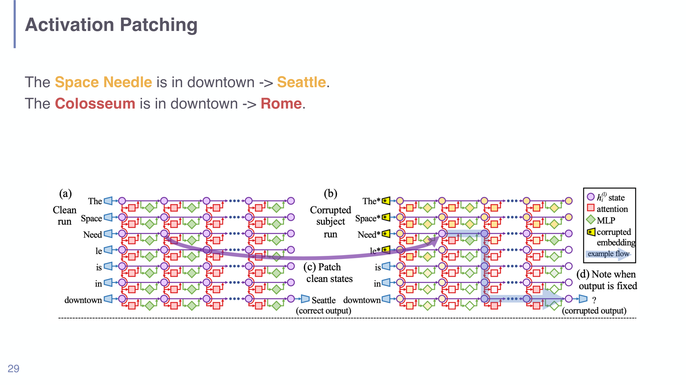
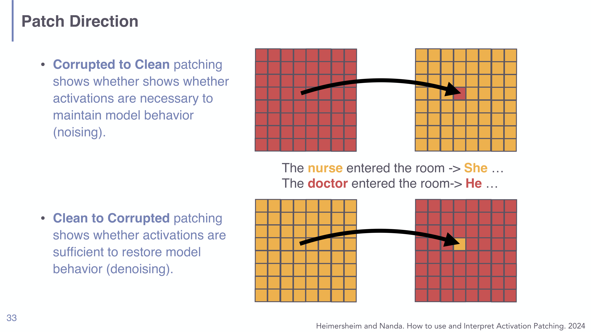

# Activation Patching in Understanding LLMs

## Short definition

**Activation patching** (a.k.a. causal tracing / causal mediation) is a causal-intervention method that locates which model components are responsible for a behaviour by running the model on a *clean* and a *corrupted* input and copying ("patching") activations from one run into the other.

## Intuition

Suppose a model correctly answers "The Space Needle is in downtown → Seattle," and you want to know *where inside the model* the fact "Space Needle ⇒ Seattle" lives. You can't just look — but you can experiment. Run a **clean** prompt (gives "Seattle") and a **corrupted** prompt (subject scrambled, so the model is confused). Now do a transplant: take the activation from one run at a specific layer/position and paste it into the other run, leaving everything else untouched. If pasting that one activation *flips the answer back to the right one*, you've found a component that carries the fact. It's the neuroscience trick of lesioning/stimulating one region and watching behaviour change — but you can do it precisely, on any component, and reversibly.

## Explanation

Activation patching upgrades interpretability from *correlational* to *causal*. Probing and attention maps can be fooled by spurious correlations; patching makes an intervention and observes the effect, which is much stronger evidence that a component *causes* a behaviour.

**The setup** (Meng et al. 2022, "Locating and Editing Factual Associations in GPT"; the Space Needle / Colosseum example):

1. **Clean run.** Feed the normal prompt ("The Space Needle is in downtown") and record all internal activations; the model outputs the correct token ("Seattle").
2. **Corrupted run.** Feed a corrupted version (e.g. the subject tokens replaced/noised) so the model no longer produces the correct answer.
3. **Patch.** Re-run the corrupted prompt but, at one chosen component (a specific layer × token position × module — residual state, attention output, or MLP output), *overwrite* its activation with the value recorded from the clean run.
4. **Measure.** See how much the output moves back toward correct. A large recovery means that component **causally carries** the information.

Sweep this over every layer and position to get a heatmap of causal effect — e.g. localising where factual knowledge sits, or which heads carry **gender bias** ("The nurse … → She" vs. "The doctor … → He").

**Choosing the metric (how to measure "did the output move?").** Options, from most to least expressive:

- **Logit difference** = logit(correct) − logit(incorrect). *Preferred*, because it isolates the contrast of interest and isn't squashed by the softmax.
- Raw class logit for the correct answer.
- Log-probability of the correct answer.
- Raw probability of the correct answer.
- Binary metrics: accuracy, or rank of the correct answer.

The softmax compresses large logit changes into tiny probability changes near saturation, so raw probability can hide real effects — hence logit difference is the default.

**Patch direction: necessity vs. sufficiency** (Heimersheim & Nanda 2024). The two directions answer different causal questions, and the lecture states them as:

- **Corrupted → Clean ("noising"):** start clean, patch in corrupted activations → tests whether the patched activations are **necessary** to maintain the behaviour. (Breaking them should break the behaviour.)
- **Clean → Corrupted ("denoising"):** start corrupted, patch in clean activations → tests whether the patched activations are **sufficient** to restore the behaviour. (Adding them back should fix it.)

Necessity and sufficiency are different claims, and a component can be one without the other; reporting which direction you used is essential.

*Activation patching (slide 29, Meng et al. 2022): (a) clean run → "Seattle"; (b) corrupted-subject run; (c) patch clean states into the corrupted run; (d) note where the output is fixed — those components causally carry the fact.*

*Patch direction (slide 33, Heimersheim & Nanda 2024): corrupted→clean patching tests necessity ("noising"); clean→corrupted tests sufficiency ("denoising"). The same component can be necessary without being sufficient, or vice versa.*

## Worked example

Localising the "capital" fact in a small GPT.

- **Clean:** "The Space Needle is in downtown" → model puts high logit on "Seattle". Record activations everywhere.
- **Corrupted:** replace the subject so the model's "Seattle" logit collapses (logit difference ≈ 0).
- **Denoising sweep (clean → corrupted):** for each layer $\ell$ and position $p$, paste the clean activation into the corrupted run and recompute logit difference. Suppose patching the residual stream at the *last subject token* around layers 15–20 restores most of the logit difference, while patching elsewhere does little.
- **Conclusion:** those mid-layer activations at the subject position are *sufficient* to restore the behaviour — strong causal evidence that the fact is read out there. You'd confirm necessity with the reverse (noising) direction and then chain such results into a circuit (→ [[Mechanistic Interpretability in Understanding LLMs]]).

## Formal definition / equations

Let $a_c$ be the activation of a chosen component on the **clean** run and $a_*$ its value on the **corrupted** run. A patch replaces it: run the (corrupted) model with the component set to $a_c$ instead of $a_*$, holding all else fixed, giving output logits $\ell_{\text{patched}}$. The **patch effect** under the recommended metric is

$$\text{effect} = \big[\,\text{logit}(\text{correct}) - \text{logit}(\text{incorrect})\,\big]_{\text{patched}} - \big[\,\text{logit}(\text{correct}) - \text{logit}(\text{incorrect})\,\big]_{\text{corrupted}}.$$

- $\text{logit}(\cdot)$ — the pre-softmax score of a token; the bracket is the **logit difference** between the correct and a contrasting incorrect token.
- A large positive effect at a component ⇒ patching the clean value there *causally* moves the model back toward the correct behaviour. Sweeping the component (layer × position × module type) produces the causal heatmap shown on the slides.

## Role in this class or project

The causal-localisation workhorse of [[Session 08 - Mechanistic Interpretability]]: it turns "this component correlates with the behaviour" into "this component causes it," and its outputs are the building blocks that **circuit analysis** assembles into mechanisms like the IOI circuit. It is the methodological bridge between probing (encoding) and full circuits (algorithm).

## Exam, assignment, or project relevance

- Describe the clean/corrupted/patch/measure loop and what a large patch effect implies.
- State why **logit difference** is the preferred metric (softmax saturation hides probability changes).
- Explain the **noising = necessity (corrupted→clean)** vs. **denoising = sufficiency (clean→corrupted)** distinction — a classic exam discriminator.
- Give an application (locating factual knowledge; localising gender bias).

## Related global concepts

None yet. Could fold into a future global **Mechanistic Interpretability** / causal-intervention page.

## Related local pages

- [[Session 08 - Mechanistic Interpretability]]
- [[Mechanistic Interpretability in Understanding LLMs]]
- [[Sparse Autoencoders and Superposition in Understanding LLMs]]
- [[Probing Classifiers in Understanding LLMs]]

## Common confusions

- **Patching ≠ attention visualization.** Patching is an *intervention* with a measured causal effect; an attention map is just an observed weight.
- **Direction matters.** Corrupted→clean (necessity) and clean→corrupted (sufficiency) are different claims; don't conflate them.
- **Use logit difference, not raw probability.** Near softmax saturation, big logit changes become invisible in probability space.
- **A located component is not yet a circuit.** Patching localises pieces; assembling and validating the mechanism (causal scrubbing) is a further step.

## Sources

- [[Session 08 - Mechanistic Interpretability]] (slides 27–33), `raw/08-Mechanistic-Interpretability.pdf`.
- Meng et al. 2022 (causal tracing / ROME); Big et al. 2020 (causal mediation analysis); Heimersheim & Nanda 2024 (how to use and interpret activation patching). Cited on the slides; not independently ingested.
