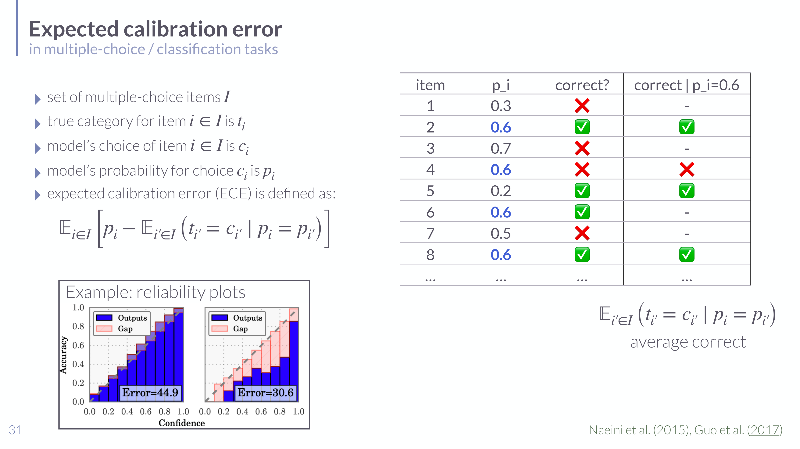

# Behavioral Assessment and Calibration in Understanding LLMs

## Short definition

**Behavioral assessment** evaluates a language model purely by its input/output behaviour (not its internals): is it correct, reliable, well-calibrated, human-like? **Calibration** is the part asking whether the model's stated confidence matches how often it is actually right.

## Intuition

Two students both score 70% on a test. Student A says "I'm 70% sure" on every answer; student B says "I'm 100% certain" on everything, including the third she got wrong. Both have the same *accuracy*, but A is **well-calibrated** (her confidence tracks reality) and B is **overconfident**. For an LM you care about both: did it pick the right answer, *and* can you trust the probability it attached to it? Behavioral assessment is the discipline of measuring these honestly — and the lecture's recurring warning is that the *standard* way of measuring can quietly cheat, because we score the model in a way it would never actually be used.

## Explanation

The governing principle is the **"common-sense axiom" of behavioral assessment**: *if you assess a system $S$ because you want to know how it performs in an application context $C$, you must test $S$ under the same circumstances as $C$.* Sounds obvious; standard practice often breaks it (see argMax below).

**A ladder of assessment methods (increasing rigour):**

1. **Tale-telling by example.** A single striking input/output (a viral failure on social media). Legitimately strong only when one instance suffices — to *refute* a universal claim, or when a system "must never get this wrong." For positive capability claims it is merely suggestive; you need many items, many models, multiple methods, ideally **antagonistic** testing.
2. **Benchmarks.** Standardised task batteries with fixed evaluation (e.g. BIG-Bench causal/empirical judgement tasks). Great for scaling comparisons and setting a shared agenda, but *caveat*: individual items can be low quality, and a benchmark named "tests ability X" need not actually isolate X — designing informative benchmarks needs real experimental-methods awareness. See [[Benchmarking LLMs in Understanding LLMs]].
3. **Quantitative metrics:** accuracy, calibration, and bias-corrected variants.

**Accuracy — and the argMax/softMax trap.** Each multiple-choice option $y_{ij}$ is scored by its log-probability $s(y_{ij})=\log P(y_{ij}\mid x_i)$. Standard accuracy picks the **arg-max** option and checks it against the truth. But a *human* answering doesn't always pick their single highest-ranked option — they sample. If you instead model **stochastic (softmax) choice**, accuracy can plummet: in the lecture's example a model whose target option is slightly better in 80% of items but catastrophically worse in 20% scores **80% under argMax but only ~40% under softMax** ($0.8\times0.5 + 0.2\times0 = 0.4$). The point isn't that one number is "right" — it's that **argMax accuracy violates the common-sense axiom** if the model is deployed sampling its outputs.

**Calibration.** A model is calibrated if, among all the times it says "60% confident," it is right about 60% of the time. Two standard metrics:

- **Brier score:** mean squared error between predicted probabilities and the one-hot truth — lower is better; rewards being accurate *and* honestly confident.
- **Expected calibration error (ECE):** the average gap between confidence and realised accuracy, read off a **reliability diagram** (accuracy vs confidence, binned). A diagonal = perfect calibration; bars below the diagonal = overconfidence.

*ECE and reliability diagrams (slide 31, Naeini et al. 2015; Guo et al. 2017): ECE averages, over confidence levels, the gap between stated confidence $p_i$ and the actual fraction correct at that confidence. The reliability plots contrast a poorly-calibrated model (Error 44.9) with a better one (30.6).*

**Bias corrections.** Raw log-prob scores are systematically biased; the lecture gives three fixes:

- **Length bias → length correction.** Longer continuations have lower total log-prob simply because more (sub-1) probabilities multiply. Fix: score by the **average per-token** log-prob, not the sum (Brown et al. 2020; often the implicit default).
- **Prompt/order bias → contextual calibration.** In k-shot in-context learning, accuracy swings with prompt format, example choice, and example order, via **majority-label bias** (prefer frequent answer categories), **recency bias** (prefer late examples), and **common-token bias** (prefer answer strings frequent in pretraining). Fix (Zhao et al. 2021): estimate the model's answer probabilities under a **null/content-free prompt** $p_\varnothing$, then apply an affine transform $F(x)=\text{softmax}(Wx+b)$ chosen so $F(p_\varnothing)$ is uniform (max entropy), and decode the corrected scores.
- **Surface-form competition → domain-conditional PMI.** Several near-synonymous correct answers split probability mass, so each loses to a single distinct wrong answer (Holtzman et al. 2021). Fix: choose the option maximising $P(y_i\mid x)/P(y_i\mid x_{\text{domain}})$ — a domain-conditional pointwise-mutual-information-style score that divides out an option's a-priori string likelihood.

## Worked example

**Reading a Brier score.** Two items, true labels A and B; the model must output category probabilities.

- *Prediction 1* (cautious): for the A-item it puts 0.6 on A; for the B-item it puts 0.5 on B.
- *Prediction 2* (confident): 0.6 on A for the A-item, but **1.0** on the wrong category for the B-item.
- Brier penalises the confident mistake hard: squaring $(1-0)$ on the wrong category contributes a full 1.0 per slot, so Prediction 2's Brier (~0.66) is *worse* than the cautious Prediction 1's (~0.41) even though both might argmax-classify similarly. Lesson: confident wrong answers are doubly punished — exactly what a calibration metric should do.

**ECE from a table.** Take all items where the model's confidence $p_i=0.6$. Suppose 5 such items and 3 are correct → empirical accuracy 0.6, matching the stated 0.6, so the contribution to ECE at that bin is ~0. Repeat per confidence level and average the gaps; large average gap ⇒ miscalibrated.

## Formal definition / equations

Scoring, arg-max accuracy, and stochastic accuracy:

$$s(y_{ij})=\log P(y_{ij}\mid x_i),\quad c_i=\arg\max_j s(y_{ij}),\quad \text{acc}=\mathbb{E}_{i}\,\delta_{c_i=t_i};\qquad P(c_i=j)\propto e^{\alpha s(y_{ij})}$$

- $t_i$ — true option; $\delta$ — indicator; $\alpha$ — softmax temperature for stochastic choice. ArgMax and stochastic accuracy can differ greatly.

Brier score and ECE:

$$\text{BS}=\frac{1}{N}\sum_{i=1}^N\sum_{j=1}^K (p_{ij}-o_{ij})^2,\qquad \text{ECE}=\mathbb{E}_{i}\big[\,p_i-\mathbb{E}_{i'}(t_{i'}=c_{i'}\mid p_{i'}=p_i)\,\big]$$

- $p_{ij}$ — predicted probability of category $j$ for item $i$; $o_{ij}$ — one-hot truth; $p_i$ — confidence in the chosen option; the inner expectation in ECE is the actual fraction correct at that confidence.

Length correction and surface-form (domain-conditional) correction:

$$s(y_{ij})=\frac{1}{|y_{ij}|}\sum_{l=0}^{|y_{ij}|}\log P(y_{ij}\mid x_i),\qquad \arg\max_i \frac{P(y_i\mid x)}{P(y_i\mid x_{\text{domain}})}$$

- $|y_{ij}|$ — option length in tokens; $x_{\text{domain}}$ — a domain-indicating prompt (e.g. the last word(s) of $x$) used to normalise out an option's base rate.

## Role in this class or project

The quantitative backbone of [[Session 09 - Behavioral Assessment and Cognitive Language Sciences]]. It sharpens the earlier [[Benchmarking LLMs in Understanding LLMs]] page with a critical, axiom-driven view and supplies the metrics used throughout machine psychology and targeted linguistic assessment. The prompt-order biases connect directly to [[In-Context Learning in Understanding LLMs]].

## Exam, assignment, or project relevance

- State and apply the **common-sense axiom**; explain how **argMax accuracy** violates it and reproduce the 80%/40% example.
- Define **Brier score** and **ECE**; read a **reliability diagram**.
- Name the three **bias corrections** (length, contextual/prompt, surface-form) with the bias each fixes and the corrective formula.
- Rank tale-telling vs benchmarks vs metrics and say when each is appropriate.

## Related global concepts

None yet. **Model calibration (Brier score / ECE)** is a strong promotion candidate (general ML evaluation).

## Related local pages

- [[Session 09 - Behavioral Assessment and Cognitive Language Sciences]]
- [[Benchmarking LLMs in Understanding LLMs]]
- [[In-Context Learning in Understanding LLMs]]
- [[Targeted Linguistic Assessment in Understanding LLMs]]
- [[Surprisal Theory in Understanding LLMs]]

## Common confusions

- **Accuracy ≠ calibration.** A model can be accurate but overconfident, or calibrated but inaccurate; report both.
- **ArgMax accuracy is not "the" accuracy.** It is one scoring convention; if the model is sampled in use, it can badly mismeasure real performance.
- **Lower Brier/ECE is better.** They are error measures, not scores to maximise.
- **Length/prompt/surface-form effects are artefacts, not capabilities.** They reflect scoring/prompt biases, so correct for them before claiming an ability.
- **A benchmark named "X" may not test "X."** Trust the construction, not the label.

## Sources

- [[Session 09 - Behavioral Assessment and Cognitive Language Sciences]] (slides 12–40), `raw/09-behaveAssess-CogSciLing.pdf`.
- Naeini et al. 2015, Guo et al. 2017 (ECE); Brown et al. 2020 (length); Zhao et al. 2021 (contextual calibration); Holtzman et al. 2021 (surface-form competition); Srivastava et al. 2023 (BIG-Bench). Cited on the slides; not independently ingested.
