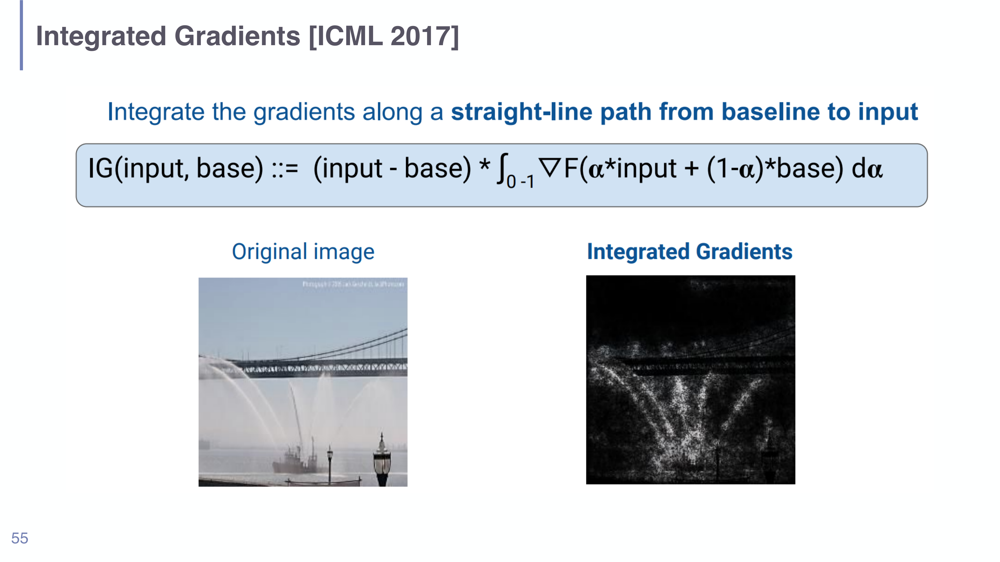

# Feature Attribution in Understanding LLMs

## Short definition

**Feature attribution** assigns each input feature (a token, a pixel, an embedding dimension) a number saying how much — and in which direction — it contributed to a particular model prediction. It is the dominant family of *local* interpretability methods.

## Intuition

The model said "fireboat" — *which parts of the picture made it say that?* Attribution paints a credit (or blame) score onto the input: the bright pixels are the ones the model leaned on, the dark ones it ignored. For text, it highlights the tokens that pushed the answer one way or the other. The point is a single, specific prediction ("local"), not the model overall — like asking "why did *this* loan get rejected?" rather than "how does the bank decide loans in general?". Different methods compute that credit differently: Shapley values do it by fair bookkeeping over feature coalitions; gradient methods do it by asking how sensitive the output is to wiggling each input.

## Explanation

This page collects the *attribution* methods from [[Session 07 - Probing and Attribution]]. They split into two lineages.

### 1. Shapley values / SHAP (game-theoretic attribution)

Borrowed from cooperative game theory. Picture the input features as **players** cooperating to produce a "gain" (the prediction); a **set-function** $v(S)$ says what gain any subset $S$ of features achieves on its own. The Shapley value $\phi_i$ is the *fair* share of the total gain attributable to feature $i$ — fair in the precise sense that it averages $i$'s **marginal contribution** over every possible order in which features could be added to the coalition.

- **Origin/analogy:** employees collaborate to make a company profit; how do you split the bonus fairly? An employee's bonus = their average marginal contribution across all the orders they could have joined.
- **Properties:** sound theoretical foundation, **model-agnostic** (so model-agnostic you may not even need the parameters, only input→output access), and **directional** (a feature can push the prediction up or down).
- **Cost:** evaluating all $M!$ orderings is **factorial** — intractable for many features unless approximated.
- **SHAP for NLP:** treat tokens as players; each token gets a positive or negative attribution toward the predicted class. SHAP is the practical sampling-based approximation.
- **Limitation:** like all attribution, it gives **no mechanistic understanding** — it tells you *which* features mattered, not *how* the network computed the answer.

### 2. Gradient tracing (sensitivity-based attribution)

Use the model's own gradients to find which inputs the output is sensitive to.

- **Ablation (naïve):** drop each feature and see how the prediction changes. Conceptually clean but **computationally expensive**, produces **unrealistic inputs**, and is **misleading when features interact**.
- **Feature × Gradient (naïve):** attribution of feature $x_i$ is $x_i \cdot \partial y / \partial x_i$. Cheap but noisy.
- **Integrated Gradients (Sundararajan et al., ICML 2017):** the principled fix. Instead of the gradient at the single input point (which can be near-zero where the function has **saturated**, even for important features), **integrate the gradient along a straight-line path** from an informationless **baseline** to the actual input. The baseline is a deliberately blank reference — a black image, or empty text / a zero embedding for text models. IG then explains the difference $F(\text{input}) - F(\text{baseline})$ in terms of input features. The saturation curve (slide 56) shows why: gradients are "interesting" early along the path and flat ("uninteresting") near the input, so only integrating recovers the full attribution.
- **Grad-CAM:** for CNNs, weight the convolutional feature maps by the gradients of the target class to produce a coarse heatmap of *where* in the image the evidence is (the famous cat/dog localisation maps), optionally combined with guided backprop for fine detail.
- **Trade-offs:** gradient methods are **model-specific** and scale to **complex models**, but suffer **input dependence** and **gradient saturation**. Practical tooling: `captum.ai`.

### Attention as attribution? (a cautionary note)

Attention weights are often read as a free attribution map ("the model looked here"). The session frames this as an open debate: **Jain & Wallace (2019)** and **Serrano & Smith (2019)** argue *no* — alternative attention weights yield near-identical predictions, and attention often fails to identify the representations that actually drive the decision; **Wiegreffe & Pinter (2019)** and **Zhong et al. (2019)** argue *maybe*, under specific tests or training. Takeaway: **do not treat raw attention as a faithful explanation** without justification. See [[Attention and Self-Attention in Understanding LLMs]].

## Worked example

**Shapley, two features (Alice & Bob).** A company makes profit depending on which employees work:

- $v(\{\}) = 0$, $v(\{\text{Alice}\}) = 20$, $v(\{\text{Bob}\}) = 10$, $v(\{\text{Alice}, \text{Bob}\}) = 50$.

Enumerate both orderings and each player's marginal contribution:

| Permutation | Marginal for Alice | Marginal for Bob |
|---|---|---|
| Alice, Bob | 20 (= 20 − 0) | 30 (= 50 − 20) |
| Bob, Alice | 40 (= 50 − 10) | 10 (= 10 − 0) |
| **Shapley value (avg)** | **30** | **20** |

So Alice's fair share is $(20+40)/2 = 30$ and Bob's is $(30+10)/2 = 20$; they sum to the total gain $50$ (a defining property of Shapley values). Swap "Alice/Bob" for "token A / token B" and "profit" for "predicted logit" and you have SHAP attribution.

## Formal definition / equations

**Shapley value** for feature $i$ with set-function $v$:

$$\phi_i(v) = \mathbb{E}_{O \sim \pi(M)}\big[\, v(\mathrm{pre}_i(O)\cup\{i\}) - v(\mathrm{pre}_i(O)) \,\big]$$

where $\pi(M)$ is the uniform distribution over all $M!$ orderings, $O$ is one ordering, and $\mathrm{pre}_i(O)$ is the set of features preceding $i$ in $O$. The bracket is $i$'s marginal contribution; the expectation averages it over all join orders.

**Integrated Gradients** of model $F$ at an input relative to a baseline:

$$\mathrm{IG}(\text{input},\text{base}) = (\text{input}-\text{base}) \cdot \int_{0}^{1} \nabla F\big(\alpha\cdot\text{input} + (1-\alpha)\cdot\text{base}\big)\, d\alpha$$

with $\alpha$ sweeping the straight path from baseline to input and $\nabla F$ the gradient at each interpolated point. It attributes the output *change* $F(\text{input}) - F(\text{base})$ across input features and repairs gradient saturation.

*Integrated Gradients (slide 55): the saliency map (right) is far cleaner than a raw gradient because the attribution integrates gradients along the baseline→input path.*

*Gradient-tracing methods compared (slide 61): vanilla gradients, guided backprop, Grad-CAM, Integrated Gradients, SmoothGrad and Blur-IG produce visibly different saliency maps for the same prediction — a reminder that "attribution" is method-dependent, not a single ground truth.*

## Role in this class or project

One of the two pillars of [[Session 07 - Probing and Attribution]] (the other being [[Probing Classifiers in Understanding LLMs]]). Attribution is the *local* lens — explaining individual predictions — and contrasts with the *global* understanding goals and with the mechanism-level account of [[Mechanistic Interpretability in Understanding LLMs]].

## Exam, assignment, or project relevance

Be able to: state the Shapley intuition and **run the Alice/Bob computation**; explain why naïve gradients fail (**saturation**) and how **Integrated Gradients** fixes it, including the role of the **baseline**; distinguish ablation / feature×gradient / IG / Grad-CAM; and articulate the "attention is [not] explanation" caution. Note the recurring caveat that attribution gives *no mechanistic* account.

## Related global concepts

None yet. A general **Feature Attribution / Shapley value** page is a promotion candidate (Shapley values and SHAP are cross-domain).

## Related local pages

- [[Session 07 - Probing and Attribution]]
- [[Probing Classifiers in Understanding LLMs]]
- [[Mechanistic Interpretability in Understanding LLMs]]
- [[Attention and Self-Attention in Understanding LLMs]]

## Common confusions

- **"Attribution explains the mechanism."** No — it identifies *influential features*, not the computation. Mechanism is the job of mechanistic interpretability.
- **"Raw gradient = importance."** Saturation means an important feature can have near-zero local gradient; that's the whole motivation for Integrated Gradients.
- **"Attention weights are a faithful explanation."** Contested — alternative weights can give the same prediction. Treat with caution.
- **"There is one correct attribution map."** Different methods (and different IG baselines) give different maps; attribution is method-relative.
- **"Shapley is cheap."** Exact Shapley is factorial in the number of features; SHAP is an *approximation*.

## Sources

- [[Session 07 - Probing and Attribution]] (slides 36–62), `raw/07-Probing-Attribution.pdf`.
- Sundararajan et al. 2017 (Integrated Gradients); Selvaraju et al. (Grad-CAM); Jain & Wallace 2019, Serrano & Smith 2019, Wiegreffe & Pinter 2019, Zhong et al. 2019 (attention debate). Cited on the slides; not independently ingested.
