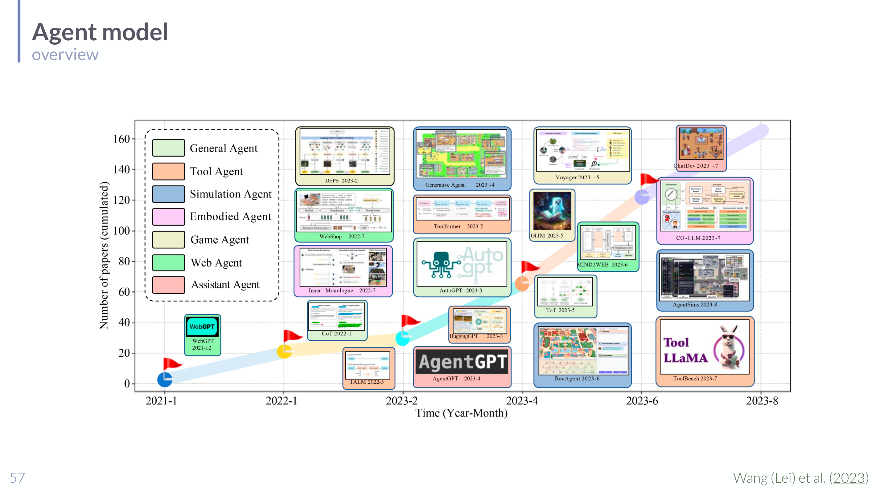
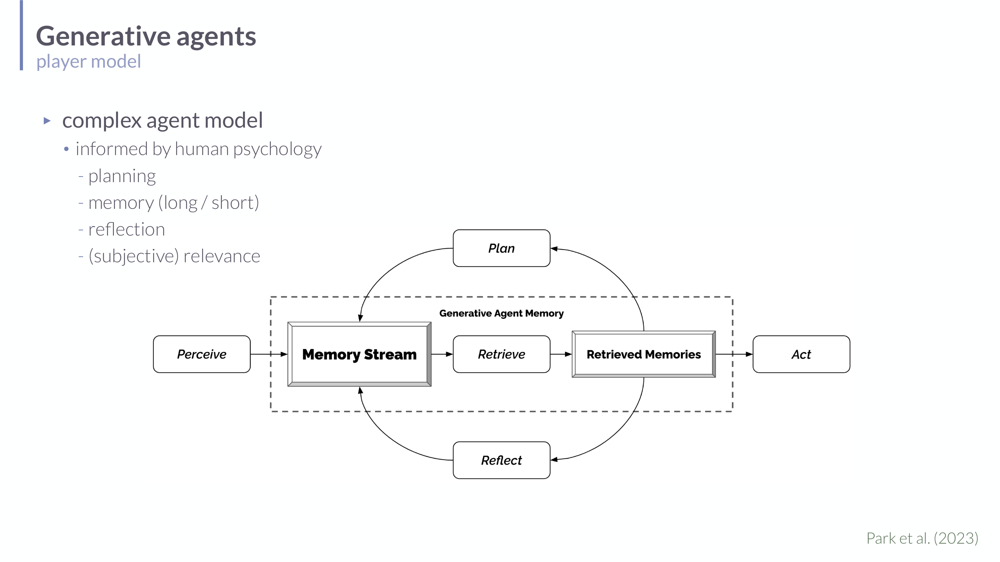

# LLM Agents in Understanding LLMs

## Short definition

An LLM agent is an LM-based application in which a language model helps determine control flow by generating actions, observing their results, and using those observations to choose later actions.

## Intuition

A plain LLM is a one-shot oracle: prompt in, text out, done. An **agent** wraps that
oracle in a **loop** and lets its text output *do things* — call a calculator, run a
search, send an email — then feeds the *result* back in as new context for the next
decision. The shift is from "the model produces an answer" to "the model decides what
to do next." Think of the LLM as the brain and the surrounding program as the body:
the brain proposes an action, the body executes it in the world, the senses report
back, and the brain proposes the next action. What makes it "agentic" is precisely that
the model influences **which step happens next**, rather than just emitting final text.
The risk follows directly: a system that can take actions in a loop can take *wrong*
actions in a loop.

## Role in this class or project

The class uses agents to mark a shift from language models as text generators to language models as components in systems that retrieve information, call tools, plan actions, store memory, reflect, and interact with environments.

## Explanation

The lecture distinguishes core LLMs, assistant-style LLMs, and LM-based applications. Agents belong to the application layer. A chatbot can be an LM-based application without being strongly agentic; an agentive system gives the LM some influence over which actions happen next.

Important examples include:

- Chat models that use conversation-specific prompting syntax but are still basically next-token predictors.
- Tool users that call calculators, search engines, APIs, calendars, or specialized systems.
- Planners that produce structured action sequences and map generated steps to executable primitive actions.
- Autonomous agents such as AutoGPT, BabyAGI, and HuggingGPT-style controller systems.
- Generative agents that simulate characters using memory, planning, reflection, and environment interaction.

The generative-agent model is especially useful because it makes agentic behavior depend on multiple components: a memory stream, retrieval, reflection, planning, and action.

## Worked example

A tool-using agent answering *"What's the population of the capital of France, divided
by 1000?"* runs a **thought → action → observation** loop:

1. **Thought:** "I need the capital of France." **Action:** `search("capital of
   France")`. **Observation:** "Paris."
2. **Thought:** "Now its population." **Action:** `search("population of Paris")`.
   **Observation:** "≈ 2,100,000."
3. **Thought:** "Divide by 1000." **Action:** `calculator(2100000 / 1000)`.
   **Observation:** "2100."
4. **Thought:** "I have the answer." **Final answer:** "About 2,100."

A non-agentic LLM would have to *guess* all of this in one pass (and likely hallucinate
the population). The agent instead **offloads** facts to search and arithmetic to a
calculator, using each observation to choose the next action — the control flow itself
is driven by the model's generated text.

## Exam, assignment, or project relevance

- Distinguish LM-based applications from LM agents.
- Explain why tool use introduces control-flow and observation loops.
- Know examples of early autonomous-agent systems and their risks.
- Explain how generative agents use memory, reflection, and planning to simulate social behavior.
- Relate agents to [[Retrieval-Augmented Generation in Understanding LLMs]] and [[Prompt Engineering in Understanding LLMs]].

## Related global concepts

No global concept page exists yet for this term.

## Related local pages

- [[Prompt Engineering in Understanding LLMs]]
- [[Retrieval-Augmented Generation in Understanding LLMs]]
- [[Language Models in Understanding LLMs]]
- [[Finetuning and RLHF in Understanding LLMs]]
- [[Language-Model-Based Evaluation and Reward Design in Understanding LLMs]]

## Common confusions

- Not every LM-based application is an agent.
- A chat model has turn-taking ability, but that alone does not imply memory, planning, or autonomous action.
- Tool use can be narrow and supervised; autonomy requires a broader loop of action, observation, and subsequent action choice.

## Sources

- [[Session 06 - In-Context Learning, Tool Use, Applications, and Agents]]
