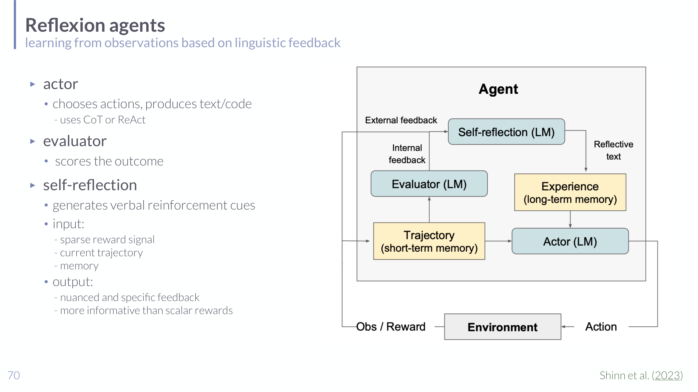

# Language-Model-Based Evaluation and Reward Design in Understanding LLMs

## Short definition

Language-model-based evaluation and reward design use LMs to judge outputs, provide feedback, evaluate trajectories, or generate reward functions for downstream optimization.

## Intuition

In [[Finetuning and RLHF in Understanding LLMs]] a *human* supplies the quality signal,
but humans are slow and expensive. The move here is to put an **LLM in the judge's
seat**: ask a model to rate, critique, or compare outputs, or even to *write the reward
function* itself. The appeal is that language is a far richer feedback channel than a
single number — "your answer is wrong because you forgot the negative sign" tells a
learner much more than "0.2/1.0." So instead of a scalar reward, an LLM can give a
*verbal* critique that another model turns into improvement. The catch is unavoidable
and worth stating up front: **the judge is itself a fallible model.** Replacing a human
rater with an LLM rater doesn't remove bias and error, it relocates them — and if you
optimize hard against an imperfect automated judge, you get the same reward-hacking
problem RLHF already warned about.

## Role in this class or project

This topic connects the previous lecture on [[Finetuning and RLHF in Understanding LLMs]] to agentic systems. Instead of humans directly rating every output or hand-designing every reward, an LM can act as evaluator, critic, feedback generator, or reward-code generator.

## Explanation

The lecture covers several related patterns:

- Reflexion agents use an actor, evaluator, self-reflection module, memory, and environment feedback. The self-reflection step turns sparse reward or failure information into verbal reinforcement cues.
- Constitutional AI replaces some human feedback with AI feedback guided by written principles, leading to RLAIF.
- Language models can be prompted with reward specifications, evaluate reinforcement-learning episodes, and translate evaluations into numerical payoffs.
- Eureka-style systems use LMs to write reward-function code, then test and improve those rewards through downstream policy learning.

The central idea is that language can provide richer evaluative structure than a scalar reward alone, but this creates new reliability and alignment questions because the evaluator is itself a learned model.

## Worked example

A **Reflexion** agent solving a coding task fails a unit test. Instead of just receiving
"reward = 0," the loop does:

1. **Actor** generates a solution; **environment** runs tests → "Test 3 failed:
   IndexError on empty list."
2. **Evaluator** flags failure; the **self-reflection** module converts the sparse
   signal into a verbal lesson: *"I didn't handle the empty-list case; add a guard."*
3. That reflection is stored in **memory** and prepended to the next attempt's prompt,
   so the actor's retry is informed by the diagnosis.

Across attempts the agent improves without any weight update — the "reward" is verbal
reinforcement, not a gradient. Contrast with **RLAIF / Constitutional AI**, where an LLM
applies written principles ("be helpful and harmless") to *critique and revise* outputs,
generating AI preference labels that replace some human labels in the RLHF pipeline.

## Exam, assignment, or project relevance

- Explain the actor-evaluator-self-reflection loop in Reflexion.
- Distinguish RLHF from RLAIF.
- Understand why reward design is difficult in reinforcement learning.
- Explain why LM-generated feedback or reward code can be useful but risky.
- Connect LMs as judges to [[Benchmarking LLMs in Understanding LLMs]].

## Related global concepts

No global concept page exists yet for this term.

## Related local pages

- [[Finetuning and RLHF in Understanding LLMs]]
- [[LLM Agents in Understanding LLMs]]
- [[Benchmarking LLMs in Understanding LLMs]]
- [[Language Models in Understanding LLMs]]

## Common confusions

- LM-based evaluation is not automatically objective; it inherits model biases and failure modes.
- RLAIF still depends on human-written principles or system design choices.
- Reward-code generation solves a specification problem only if the generated reward aligns with the intended task fitness.

## Sources

- [[Session 06 - In-Context Learning, Tool Use, Applications, and Agents]]
