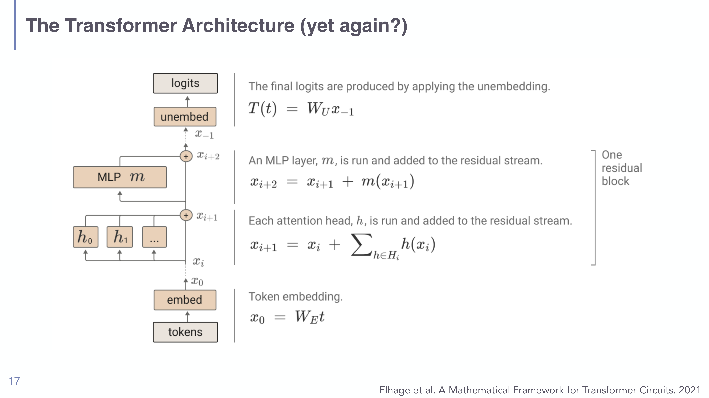
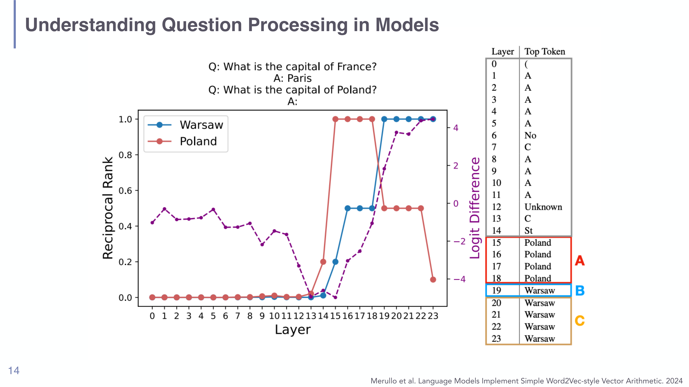
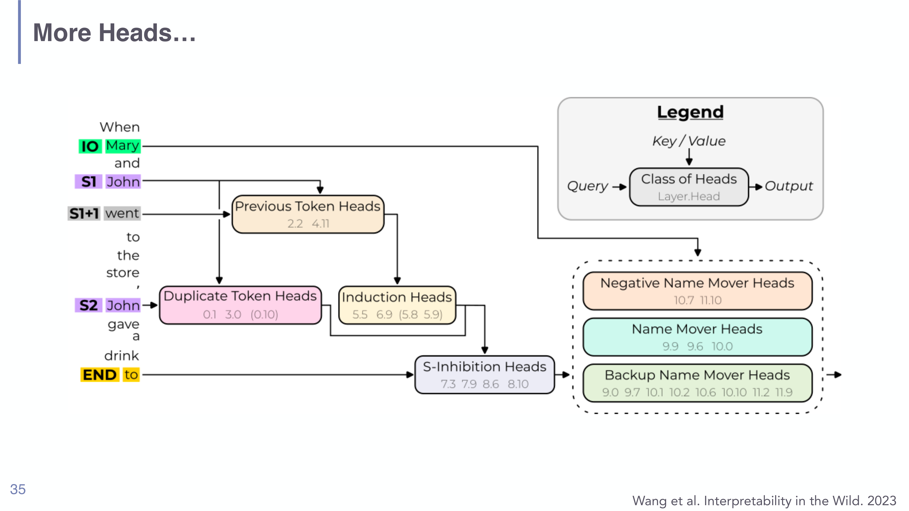

# Mechanistic Interpretability in Understanding LLMs

## Short definition

Mechanistic interpretability (MI) is the attempt to **reverse-engineer the internal computations of a trained model** into human-understandable algorithms — not just "which inputs mattered," but *how* the network turns inputs into outputs, component by component.

## Intuition

Imagine you're handed a compiled program with no source code, only the machine instructions, and asked to explain what it does. You'd trace which memory addresses get read and written, find reusable subroutines, and gradually rebuild the algorithm. MI does this for a Transformer: the "memory" is the **residual stream**, the "subroutines" are **attention heads and MLPs**, and the goal is to recover the human-readable algorithm the model learned. Crucially this is *mechanism*, not *correlation*: attribution (Session 07) tells you the model "looked at" a token; MI tries to say "this head copies the previous occurrence's successor token into the stream, and that's why the prediction is what it is."

## Explanation

MI is the deep end of interpretability. [[Feature Attribution in Understanding LLMs]] and [[Probing Classifiers in Understanding LLMs]] are *post-hoc and behavioural* — they reveal what correlates with the output or what is *encoded*, but not the computation. Their weaknesses (negatives are hard to interpret, absence of signal is ambiguous, probe performance can be misleading) are exactly what MI sets out to fix by getting at the actual circuit.

**The residual-stream picture of the Transformer.** The starting move (Elhage et al. 2021, "A Mathematical Framework for Transformer Circuits") is to rewrite a decoder-only Transformer to expose its linearity. The token embedding *writes* a vector to a central **residual stream**; then every attention head and every MLP **reads from the stream, computes something, and adds its result back**; finally the unembedding *reads* the final stream to produce logits. Nothing overwrites the stream — each block adds to a running sum. Two consequences drive most of MI:

- Because layers communicate only through this additive stream, you can talk about **virtual weights**: multiplying out the linear maps reveals implicit connections between non-adjacent layers (how much layer 3 reads what layer 1 wrote). A head can route information to specific later layers by using particular **subspaces** of the stream.
- The stream is **high-dimensional** (hundreds to tens of thousands of dimensions) but each head operates on small subspaces, so the model's *computational* bandwidth exceeds its *communication* bandwidth ("bottleneck activations"); some heads behave as **memory managers** that clean up or move information.

*The residual-stream rewrite (slide 17, Elhage et al. 2021): embed writes $x_0=W_E t$; each head adds $\sum_h h(x_i)$; the MLP adds $m(x_{i+1})$; unembed reads $T(t)=W_U x_{-1}$. The whole network is additive edits to one shared bus.*

**Attention heads = QK circuit + OV circuit.** Each head factors into a **query-key (QK) circuit** that decides *where to attend* and an **output-value (OV) circuit** that decides *what to write* given that attention. Separating them makes the mechanism legible, and a recurring discovery is that **most Transformer operations are achieved by copying** information from one position to another. The clearest learned example is the **induction head**: if the current token has appeared before, the head attends to the token that *followed* that earlier occurrence and copies it — implementing pattern completion `[A][B] … [A] → [B]`. (If no match, it dumps attention onto the first token.) Induction heads are a large part of why in-context learning works.

**Early decoding / the logit lens.** Since the residual stream keeps the same geometry across depth and the unembedding $W_U$ maps it to vocabulary, you can apply $W_U$ to *intermediate* states and ask "what does the model want to say *here*?" This is reminiscent of probing but needs no trained probe. The capital-of-Poland example is the canonical demo: across layers the top token moves from generic fillers → the subject "Poland" → finally the answer "Warsaw," and the model effectively performs a Word2Vec-style vector computation (capital-of) inside its layers.

*Logit lens (slide 14, Merullo et al. 2024): decoding each layer's residual state for "the capital of Poland is" shows the subject token ("Poland") dominating in middle layers and the answer ("Warsaw") only emerging late — visible mechanism, not just correlation.*

**Causal localisation: activation patching.** To move from "this component correlates" to "this component *causes*," MI uses **activation patching** (causal tracing): run the model on a clean and a corrupted input and copy activations between the runs to see which components are causally responsible for a behaviour. This is important enough to have its own page → [[Activation Patching in Understanding LLMs]].

**Circuit analysis.** Located components are assembled into a **circuit** — a wiring diagram of which heads feed which. The textbook case is the **IOI** ("Indirect Object Identification") task — "When Mary and John went to the store, John gave a drink to → **Mary**" — whose circuit (Wang et al. 2023) chains Previous-Token, Duplicate-Token, Induction, S-Inhibition, Name-Mover, and Negative/Backup Name-Mover heads. A hypothesised circuit is then stress-tested with **causal scrubbing** (Chan et al. 2022): systematically replace every component the hypothesis says should be irrelevant and check the behaviour survives.

*The IOI circuit (slide 35, Wang et al. 2023, "Interpretability in the Wild"): a real, discovered algorithm built from specialised head classes — the kind of mechanism MI aims to recover.*

**Beyond heads: superposition and features.** Attention is relatively well-behaved, but MLPs and individual neurons are messy: a single neuron is **polysemantic** (fires for unrelated concepts). This is explained by **superposition** — models pack more concepts than neurons by representing each as a linear combination across many neurons. Pulling these apart into interpretable, monosemantic **features** is the job of **sparse autoencoders and transcoders** → [[Sparse Autoencoders and Superposition in Understanding LLMs]].

## Worked example

**Reading a prediction with the logit lens.** Prompt: "The capital of Poland is ___".

1. Run the model and capture the residual-stream vector $x_i$ at every layer $i$ for the final position.
2. For each layer, compute $W_U x_i$ and take the top token. Early layers ($i \approx 0$–11) emit generic tokens ("A", "(", "Unknown"); middle layers ($i \approx 15$–18) emit the **subject** "Poland"; late layers ($i \ge 19$) emit the **answer** "Warsaw".
3. Interpretation: the model first *retrieves the subject*, then *applies the capital-of relation* as an internal vector operation, and only commits to "Warsaw" in the last layers. No probe was trained — the model's own unembedding read out the mechanism.

## Formal definition / equations

The residual-stream rewrite (decoder-only "toy" Transformer; no biases/LayerNorm):

$$x_0 = W_E t,\qquad x_{i+1} = x_i + \sum_{h \in H_i} h(x_i),\qquad x_{i+2} = x_{i+1} + m(x_{i+1}),\qquad T(t) = W_U x_{-1}$$

- $t$ — input token; $W_E$ — embedding; $W_U$ — unembedding; $x_i$ — residual state at depth $i$ (a running sum); $H_i$ — heads at layer $i$; $h,m$ — head and MLP functions; $x_{-1}$ — final state; $T(t)$ — logits.
- The additivity is the whole point: each block contributes a term to the sum, so contributions can be studied in isolation and "virtual weights" between layers (e.g. $W_O^{(2)}W_O^{(1)}$) can be multiplied out.

Logit lens: $\text{logits}_i = W_U x_i$ for any intermediate $i$.

## Role in this class or project

The central topic of [[Session 08 - Mechanistic Interpretability]], building on the attribution/probing toolkit of [[Session 07 - Probing and Attribution]] and the architecture from [[Transformer Architecture in Understanding LLMs]] and [[Attention and Self-Attention in Understanding LLMs]]. It is contrasted in the course with *behavioural* assessment (Session 09): MI opens the box; behavioural testing studies the closed box's outputs.

## Exam, assignment, or project relevance

- Define MI and distinguish it from attribution and probing (mechanism vs. correlation vs. encoding).
- Write and explain the **residual-stream equations**; explain why additivity enables "virtual weights" and the **logit lens**.
- Explain **QK vs. OV circuits** and **induction heads** (pattern completion).
- Know the **IOI circuit** as the worked example of circuit analysis and **causal scrubbing** as its validation.
- Connect to [[Activation Patching in Understanding LLMs]] and [[Sparse Autoencoders and Superposition in Understanding LLMs]].

## Related global concepts

No global concept page exists yet; **Mechanistic Interpretability** is a promotion candidate if it recurs in another class.

## Related local pages

- [[Session 08 - Mechanistic Interpretability]]
- [[Activation Patching in Understanding LLMs]]
- [[Sparse Autoencoders and Superposition in Understanding LLMs]]
- [[Probing Classifiers in Understanding LLMs]]
- [[Feature Attribution in Understanding LLMs]]
- [[Transformer Architecture in Understanding LLMs]]
- [[Attention and Self-Attention in Understanding LLMs]]

## Common confusions

- **MI ≠ attribution.** Attribution says *which* features mattered; MI says *how* the computation runs. A saliency map is not a mechanism.
- **The logit lens is not a trained probe.** It reuses the model's own unembedding on intermediate states; no extra classifier is trained.
- **The residual stream is not "the activations of one layer."** It is the shared, additively-updated bus that all layers read from and write to.
- **Good benchmark performance ≠ mechanistic understanding.** A model can ace tasks while remaining a black box.
- **Attention visualization alone is not a mechanism.** Knowing where a head attends (QK) omits what it writes (OV) and how it composes with other heads.

## Sources

- [[Session 08 - Mechanistic Interpretability]] (primary), `raw/08-Mechanistic-Interpretability.pdf`.
- [[Session 01 - Introduction]], [[Session 04 - Transformer-based LMs, Benchmarking, Interpretability, Foundation Models]], [[Transformer-Based Language Models]].
- Elhage et al. 2021 (Transformer circuits); Merullo et al. 2024 (logit-lens vector arithmetic); Wang et al. 2023 (IOI); Chan et al. 2022 (causal scrubbing). Cited on the slides; not independently ingested.
