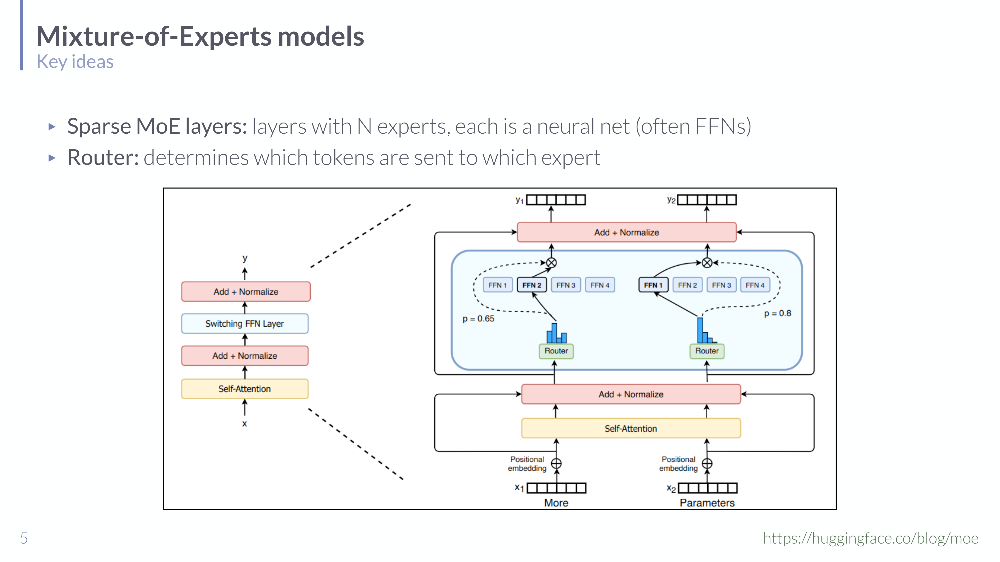

# Mixture-of-Experts in Understanding LLMs

## Short definition

A **Mixture-of-Experts (MoE)** model replaces a dense layer (usually a feed-forward network) with many parallel "expert" sub-networks plus a **router** that sends each token to only one or a few experts — so the model has far more parameters than it activates per token.

## Intuition

A dense Transformer is like one generalist doctor who must personally handle every patient — comprehensive but slow, and every bit of knowledge is used for every case. An MoE is a clinic of specialists with a triage nurse at the door: the **router** glances at each patient (token) and sends them to the two or three most relevant specialists (experts), leaving the rest idle. The clinic *as a whole* knows a huge amount (many experts = many parameters), but any single patient only ever consumes a couple of specialists' time (low compute per token). That decoupling — **lots of total capacity, little compute per token** — is the entire appeal.

## Explanation

The problem MoE solves: making models more capable usually means more parameters, and in a **dense** model every parameter is used for every token, so compute grows with capacity. MoE breaks that link by making the network **sparse and conditional**.

A **sparse MoE layer** contains $N$ **experts**, each a small neural network (typically a feed-forward / FFN block). For each incoming token, a lightweight **router** (also called a gating network) produces a distribution over experts and selects the top-$k$ (often $k=1$ or $2$). Only those experts run; their outputs are combined (weighted by the router scores) and passed on. So:

- **Total parameters** scale with the number of experts $N$ (huge capacity).
- **Active parameters per token** scale only with $k$ (cheap compute).

In a Transformer, the MoE layer usually replaces the FFN sub-layer inside a block (a "switching FFN layer"), while attention stays dense. Different tokens in the same sequence can be routed to different experts — in the slide's example, two positions get routed with router weights like $p=0.65$ and $p=0.8$ to different FFN experts.

*MoE layer (slide 5, HuggingFace MoE blog): the dense FFN is replaced by $N$ expert FFNs and a router that selects which expert(s) each token uses — "more parameters" without "more compute per token."*

The lecture presents MoE at a recap/architecture level. The practical complications it implies (but does not detail) are **load balancing** — without care the router collapses onto a few favourite experts, wasting the rest — which is normally handled with auxiliary balancing losses, and the **communication/memory** cost of holding all experts in memory even though only a few run.

## Worked example

Suppose a dense FFN sub-layer has 8 billion parameters and runs for every token. Convert it to an MoE layer with **8 experts** of 8B parameters each and a **top-1** router:

- **Total parameters:** ~64B (8 × 8B) plus a tiny router — roughly 8× the capacity.
- **Active parameters per token:** ~8B — the *same* compute as the original dense layer, because each token uses exactly one expert.
- **Effect:** the model can store much more specialised knowledge (one expert may specialise in code, another in punctuation, another in a language) while each token's forward pass stays cheap. This is why frontier-scale models increasingly use MoE: capacity scales with experts, FLOPs scale with $k$.

## Formal definition / equations

For a token representation $x$, a router $g$ produces scores over experts $E_1,\dots,E_N$; let $\mathcal{T}$ be the top-$k$ selected experts. The layer output is the gated combination:

$$\text{MoE}(x) = \sum_{n \in \mathcal{T}} g_n(x)\, E_n(x),\qquad g(x) = \text{softmax}\big(W_r x\big)$$

- $E_n(x)$ — the $n$-th expert network applied to $x$ (e.g. an FFN); $g_n(x)$ — the router weight for expert $n$; $W_r$ — the router's (small) weight matrix.
- Only the $k$ experts in $\mathcal{T}$ are evaluated, so the sum has $k$ terms regardless of $N$. The router weights both *select* and *blend* the chosen experts. (The lecture states the router/expert idea conceptually; this is the standard top-$k$ gating formalisation.)

## Role in this class or project

One of two "more flavours of LMs" opening [[Session 09 - Behavioral Assessment and Cognitive Language Sciences]] (the other being large reasoning models). It extends the architecture line from [[Transformer Architecture in Understanding LLMs]] by showing how to grow capacity without growing per-token compute, and connects to efficiency themes from earlier sessions.

## Exam, assignment, or project relevance

- Define an MoE layer (experts + router) and state the key trade-off: **total parameters ≫ active parameters per token**.
- Explain *why* MoE is efficient (conditional/sparse computation) versus a dense model.
- Know that the router does top-$k$ selection and that load balancing is the main practical challenge.

## Related global concepts

None yet. **Mixture-of-Experts** is a good promotion candidate (general deep-learning architecture, not LLM-specific).

## Related local pages

- [[Session 09 - Behavioral Assessment and Cognitive Language Sciences]]
- [[Session 10 - Efficient and Alternative Architectures]]
- [[Transformer Architecture in Understanding LLMs]]
- [[State Space Models in Understanding LLMs]]
- [[Model Compression in Understanding LLMs]]

## Common confusions

- **MoE ≠ ensemble.** An ensemble runs *all* models and averages; an MoE runs only the *few selected* experts per token. The point is to *avoid* running everything.
- **More parameters ≠ more compute here.** That's exactly the decoupling MoE buys; per-token FLOPs depend on $k$, not $N$.
- **Experts aren't human-interpretable specialists by design.** Specialisation is emergent and often not cleanly semantic; "expert" is an architectural role, not a guaranteed topic.
- **Memory still scales with $N$.** All experts must be stored even though only $k$ run — MoE saves compute, not memory.

## Sources

- [[Session 09 - Behavioral Assessment and Cognitive Language Sciences]] (slides 3–5), `raw/09-behaveAssess-CogSciLing.pdf`.
- HuggingFace MoE blog (huggingface.co/blog/moe), cited on the slide; not independently ingested.
