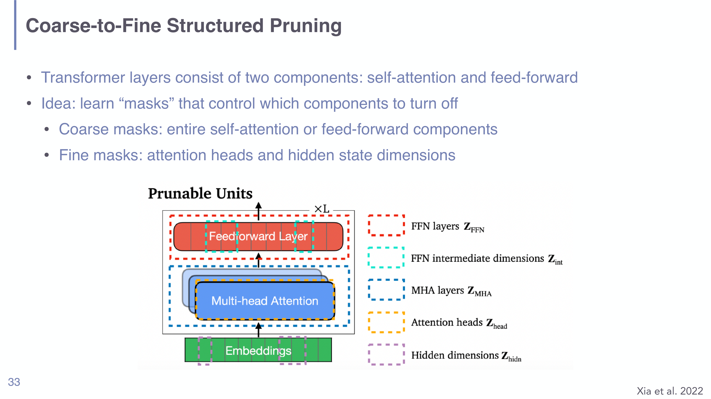
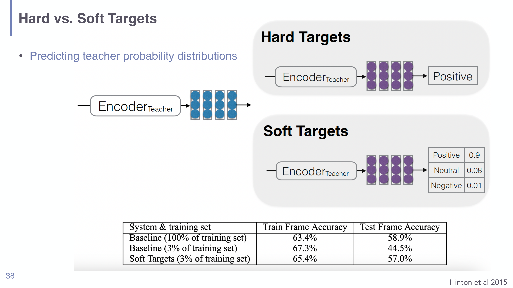

# Model Compression in Understanding LLMs

## Short definition

**Model compression** makes a trained model cheaper to store and run without
retraining it from scratch, through three complementary moves:
**quantization** (store weights in fewer bits), **pruning** (set unimportant
weights to zero), and **distillation** (train a small student to imitate a large
teacher).

## Intuition

Think of a trained model as a giant, lavishly detailed reference book.

- **Quantization** is reprinting it on cheaper paper with slightly coarser type:
  every word is still there, it just takes less shelf space and is a touch harder
  to read.
- **Pruning** is tearing out the pages nobody ever consults: the book gets
  thinner, and the remaining pages are untouched.
- **Distillation** is hiring a bright student to read the whole book and write a
  much shorter summary that captures how the expert *thinks*, not just the final
  answers — a brand-new, smaller book.

The lecture's organizing question is purely economic: **inference cost dominates
training cost at scale** (ChatGPT's weekly inference bill exceeds its training
bill), so anything that shrinks the deployed model pays off forever.

## Explanation

The deck distinguishes the three methods by **what they do to the parameters** —
the cleanest way to keep them straight:

| Method | What happens to parameters | Reversible? |
|---|---|---|
| **Quantization** | values unchanged, stored at lower precision (e.g. FP16→INT4) | largely |
| **Pruning** | a fraction set to **exactly zero**, rest unchanged | no |
| **Distillation** | **~all** parameters change (new student trained) | no |

### Quantization
Represent each weight with fewer bits — for example 16-bit floats down to 4-bit
integers — by mapping the range of weight values onto a small grid of levels. The
*information* in each weight is degraded slightly (rounding), but no weight is
removed. It gives the biggest memory win for the least structural disruption,
which is why the deck treats it as the baseline compression move. The trade-off is
**precision**: too few bits and accumulated rounding error degrades the model.

### Pruning
Set a chosen fraction of weights to zero and leave the rest exactly as they were.
Variants, from crude to practical:

- **Magnitude pruning** (Han et al. 2015): zero the $p\%$ of weights with the
  smallest absolute value, on the premise that small weights matter least. This is
  **unstructured** — the zeros are scattered anywhere in the weight matrices.
- **Wanda** (Sun et al. 2023): score weights by **magnitude × activation size**,
  $s_i = |w_i|\,\|x_i\|$, so a small weight that nonetheless multiplies a large
  activation (and therefore matters) is kept.
- **Structured pruning** (Xia et al. 2022): remove **whole components** — attention
  heads, FFN hidden dimensions, or entire layers — via learned **masks**. *Coarse*
  masks switch off an entire self-attention or feed-forward block; *fine* masks
  switch off individual heads or hidden dimensions.
- **Pruning with forward passes** (Dery et al. 2024): structured pruning of big
  models is memory-hungry if it needs gradients, so instead mask modules, *measure*
  the performance drop, and **regress** each module's importance — no backprop.

*Structured pruning removes whole units via learned masks — coarse masks drop an
entire FFN or multi-head-attention block; fine masks drop individual attention
heads or hidden dimensions (deck p33, Xia et al. 2022).*

**The crucial catch:** *unstructured* sparsity does **not** by itself improve
memory or speed. A weight set to zero still sits in the matrix; you only save
compute if the hardware can skip zeros, and commodity GPUs largely cannot exploit
fine-grained sparse multiplies. **Structured** pruning avoids this because removing
a whole head/dimension yields a genuinely smaller *dense* tensor that runs faster
on any hardware. This is the single most exam-worthy subtlety of the section.

### Distillation
A small **student** network is trained to reproduce a large **teacher's**
behavior — so nearly all of the student's parameters end up different from the
teacher's. The engine is **weak supervision**: the teacher produces
**pseudo-labels** for unlabeled text and the student trains on them as if real
(an old idea — self-training, co-training, meta pseudo-labels).

The key insight (**hard vs. soft targets**, Hinton et al. 2015) is to train on the
teacher's full **probability distribution**, not the one-hot answer. The soft
distribution carries **dark knowledge** — the relative probabilities of the wrong
answers encode similarity structure ("cat" makes "dog" a bit likely but "car"
not) that a hard label throws away.

*Hard targets give the student only the one-hot label; soft targets pass the
teacher's full distribution (Positive 0.9 / Neutral 0.08 / Negative 0.01). The
table shows soft targets recovering most accuracy even with only 3% of the
training data (deck p38, Hinton et al. 2015).*

- **Sequence-level distillation** (Kim & Rush 2016): for generation, *word-level*
  distillation matches the teacher's per-step token distribution; *sequence-level*
  distillation trains the student to maximize the probability of the whole
  sequences the teacher produces.
- **DistilBERT** (Sanh et al. 2019): half the layers, ~60% of parameters,
  initialized from alternating BERT layers, trained with a combined supervised +
  distillation loss plus a cosine term aligning student/teacher hidden states.
- **Self-Instruct** (Wang et al. 2022) / **Prompt2Model**: distillation for
  *instruction following* — a model synthesizes and pseudo-labels its own
  instruction data, then trains on it.

## Worked example

Suppose a 7B-parameter model stored in FP16 occupies ~14 GB.

- **Quantize** to INT4: each parameter uses 4 bits instead of 16, so memory drops
  ~4× to ~3.5 GB. No parameter is removed; outputs shift slightly from rounding.
- **Magnitude-prune** 50% unstructured: half the weights become zero, but the
  tensor shape is unchanged, so on a normal GPU it is **still ~14 GB and no
  faster** — the zeros are not skipped. Only with sparse-aware hardware, or with
  *structured* pruning that deletes whole heads/layers, do you get a real speedup.
- **Distill** into a 2B student: a brand-new, much smaller model trained on the 7B
  teacher's soft outputs — ~3× fewer parameters, retaining most accuracy
  (DistilBERT kept most of BERT's performance at ~60% of the size).

These compose: production models are often distilled *and* quantized.

## Formal definition / equations

**Quantization (uniform, schematic).** Map a real weight $w$ in range
$[w_{\min}, w_{\max}]$ to one of $2^k$ levels with step
$\Delta = (w_{\max}-w_{\min})/(2^k-1)$:
$$ \hat w = \Delta \cdot \mathrm{round}\!\left(\frac{w - w_{\min}}{\Delta}\right) + w_{\min}. $$
$k$ is the bit-width; smaller $k$ = coarser grid = more memory saved but more
rounding error.

**Magnitude pruning.** With sparsity $p$ and mask $m_i\in\{0,1\}$,
$$ m_i = \mathbb{1}\!\left[\,|w_i| > \theta_p\,\right], \qquad w_i \leftarrow m_i\, w_i, $$
where $\theta_p$ is the magnitude threshold below which the smallest $p\%$ of
weights fall. **Wanda** replaces $|w_i|$ with the score $s_i = |w_i|\,\|x_i\|$.

**Distillation loss.** With teacher logits $z^T$, student logits $z^S$, temperature
$\tau$, soft distributions $p^T=\mathrm{softmax}(z^T/\tau)$,
$p^S=\mathrm{softmax}(z^S/\tau)$:
$$ \mathcal{L} = \alpha\,\underbrace{\mathcal{L}_{\text{CE}}(y, z^S)}_{\text{hard label}} + (1-\alpha)\,\tau^2\underbrace{\sum_i p^T_i \log\frac{p^T_i}{p^S_i}}_{\text{match teacher (KL)}}. $$
- $y$: true hard label; $\mathcal{L}_{\text{CE}}$: ordinary cross-entropy.
- $\tau>1$: temperature that *softens* both distributions so the student sees the
  teacher's small "dark knowledge" probabilities; the $\tau^2$ restores gradient
  scale.
- $\alpha$: balances trusting the gold label vs. imitating the teacher.

## Role in this class or project

Introduced in [[Session 10 - Efficient and Alternative Architectures]] as the
*shrink-the-Transformer* half of the efficiency toolkit (the other half being
alternative architectures: [[State Space Models in Understanding LLMs]],
[[Mixture-of-Experts in Understanding LLMs]]). It is the inference-side counterpart
to the training-side efficiency of
[[Parameter-Efficient Finetuning in Understanding LLMs]].

## Exam, assignment, or project relevance

- **The three-way contrast** (precision lowered / weights zeroed / all retrained) —
  this table appears twice in the deck and is the obvious exam question.
- **Why unstructured pruning often yields no real speedup**, and how structured
  pruning fixes it — the section's key subtlety.
- **Soft vs. hard targets** and *why* soft targets transfer more (dark knowledge),
  including the role of temperature $\tau$.

## Related global concepts

- Promotion candidates: **Knowledge Distillation**, **Model Pruning**,
  **Quantization** (all reusable beyond this class).

## Related local pages

- [[State Space Models in Understanding LLMs]]
- [[Mixture-of-Experts in Understanding LLMs]]
- [[Parameter-Efficient Finetuning in Understanding LLMs]]
- [[Transformer Architecture in Understanding LLMs]]

## Common confusions

- **"Pruning shrinks the model, so it must be faster."** Only if the sparsity is
  *structured* or the hardware exploits sparsity. Unstructured magnitude pruning
  leaves the tensor the same size; the zeros are still multiplied.
- **"Quantization removes weights."** No — every weight survives; only its
  numerical precision drops. Pruning removes (zeros) weights; distillation replaces
  them.
- **"The student just copies the teacher's answers."** It copies the teacher's full
  *distribution*; the information that makes distillation work is precisely in the
  probabilities the teacher assigns to the *wrong* answers.

## Sources

- [[Session 10 - Efficient and Alternative Architectures]] (Han 2015, Sun 2023,
  Xia 2022, Dery 2024, Hinton 2015, Kim & Rush 2016, Sanh 2019, Wang 2022)
