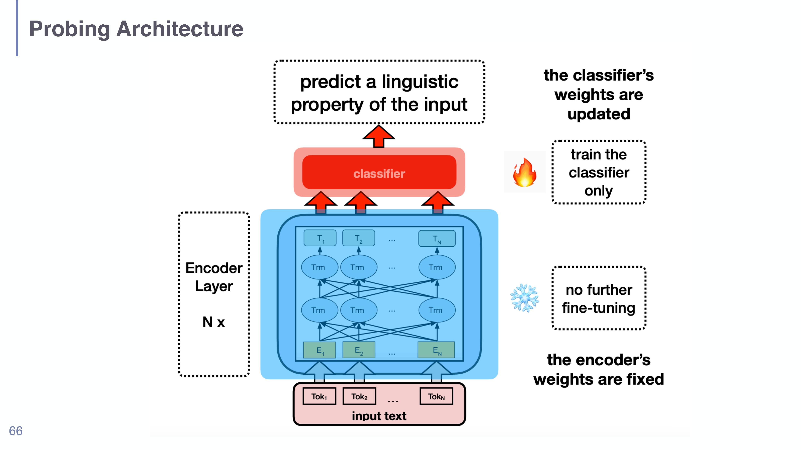
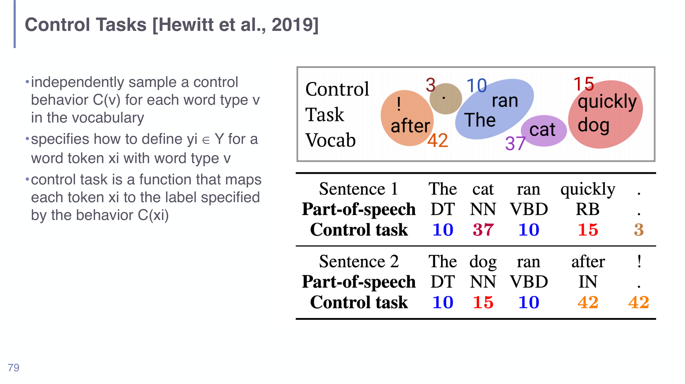
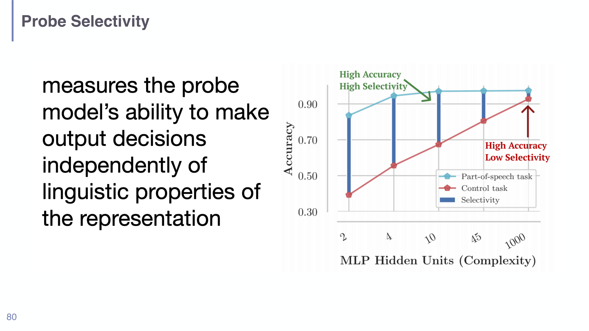

# Probing Classifiers in Understanding LLMs

## Short definition

A **probing classifier** is a small supervised classifier trained on a frozen model's internal representations to test whether some linguistic property (part of speech, syntax tree, coreference, …) is *encoded* in those representations.

## Intuition

Think of a trained language model as a sealed box that turns text into vectors. You suspect the box "knows" grammar, but you can't ask it directly. So you run a little experiment: take the box's output vectors, hide the box's own task, and try to train a tiny classifier to read *one specific property* off those vectors — say, "is this word a noun?". If a small classifier can recover the property from the vectors, the property must be written *somewhere* in them. If even a reasonable classifier can't, the property is either absent or not stored in a usable form. The probe is a thermometer dipped into the representation: it doesn't change the box, it just reads what's already there.

## Explanation

Probing answers a precise question — **"Is property $P$ linearly/simply decodable from this representation?"** — and deliberately *not* the question "does the model *use* $P$ when it makes predictions?". Keeping those apart is the whole discipline of the method.

The setup (see the architecture figure):

1. Take a pretrained encoder (e.g. BERT) that was trained on some original objective.
2. **Freeze it** — its weights do not change (the "❄️" in the diagram). You only ever run it forward to get representations.
3. Feed in text, collect the representation vectors (per token, or pooled per sentence).
4. **Train a small classifier** (often linear or a tiny MLP) on top of those frozen vectors to predict the target property. Only the classifier's weights update (the "🔥").
5. Measure the classifier's accuracy. High accuracy ⇒ the property is encoded and decodable.

Why probe at all (motivation slide)? *If* a classifier can predict property $P$ from the representation, the property is encoded there; *if* it cannot, the property is either not encoded or not encoded in a usefully accessible way. Probing tasks are deliberately **simple classification problems** so that the result is easy to interpret, biases are easy to control, and the method stays **architecture-agnostic** — it works on anything that emits a vector. A key caveat: **probing accuracy does not have to correlate with downstream task performance.** A property can be decodable yet unused, or used yet hard to decode linearly.

**The central danger: a probe that is too powerful learns the task itself.** If you let the probe be a large neural network, it might achieve high accuracy not because the representation encodes the property, but because the probe *computed* the property from scratch. Then you've measured the probe, not the model. Two tools defend against this:

- **Control tasks (Hewitt et al. 2019).** Build a deliberately meaningless version of the task: for each *word type* $v$ in the vocabulary, independently sample a random control label $C(v)$, then label every token of that type with its random label. A real linguistic structure is destroyed; the only way to do well is to **memorise** the (token type → random label) map. The diagram shows "The/cat/ran/quickly" getting random control labels 10/37/10/15 instead of real POS tags. A *good* probe should do well on the real task and **poorly** on the control task.
- **Selectivity.** Defined as (real-task accuracy − control-task accuracy). You want **high accuracy AND high selectivity**: the probe reads the representation but cannot brute-force arbitrary labels. The selectivity figure shows that as you increase probe complexity (MLP hidden units), control-task accuracy climbs too — so raw accuracy alone is misleading, and selectivity is the honest signal.

**A robust empirical finding** (Peters et al. 2018): probing across layers shows **early layers capture local syntax** (POS tagging peaks low) **and later layers capture higher-level content/semantics** (coreference peaks higher). This layer-wise specialisation holds across LSTM and Transformer encoders and is a frequently-cited, exam-worthy result. Probing can also help **localise task-specific computations** to particular layers.

The historical seed of all this is the **"sentiment neuron"**: an L1-regularised linear model trained on text used surprisingly few units, and inspection revealed a *single* unit whose value cleanly separated positive from negative reviews — an individual dimension of the representation that had spontaneously come to encode sentiment.

## Worked example

Suppose you want to know whether BERT encodes part-of-speech.

1. Freeze BERT. Run the sentence "The cat ran quickly." → get a vector per token.
2. **Real task:** train a linear classifier to map each token vector to its POS (DET, NN, VBD, RB). Say it reaches **97% accuracy**.
3. Is 97% impressive? Run the **control task**: relabel every word type with a fixed random tag (e.g. *The*→10, *cat*→37, *ran*→10, *quickly*→15) and retrain the same probe. Suppose it reaches **62%** purely by memorising types.
4. **Selectivity = 97 − 62 = 35 points.** That large gap means the probe is reading genuine POS structure from BERT's vectors, not memorising. Had the control accuracy also been ~95% (low selectivity ≈ 2), the 97% would be meaningless — the probe was just powerful.

## Formal definition / equations

Let $r = \text{Encoder}(x)$ be the frozen representation of input $x$, and let the probe be a classifier $g_\theta$ trained to predict label $y$:

$$\hat{y} = g_\theta(r), \qquad \theta^* = \arg\min_\theta \; \mathcal{L}\big(g_\theta(\text{Encoder}(x)),\, y\big)$$

with the encoder's parameters held **fixed**. The diagnostic is the resulting accuracy, and the honest version of it is **selectivity**:

$$\text{selectivity} = \underbrace{\text{acc}_{\text{real}}}_{\text{linguistic task}} - \underbrace{\text{acc}_{\text{control}}}_{\text{random per-type labels }C(v)}$$

A high $\text{acc}_{\text{real}}$ is only evidence about the *representation* when selectivity is also high; otherwise the high accuracy is attributable to the *probe*.

*Probing architecture (slide 66): the encoder's weights are frozen (❄️); only the classifier on top is trained (🔥) to predict a linguistic property. This separation is what makes the result a statement about the representation.*

*Control tasks (Hewitt et al. 2019, slide 79): each word type gets a fixed random label, so the only way to succeed is memorisation — the foil against which selectivity is measured.*

*Selectivity (slide 80): as probe complexity grows, control-task accuracy rises too; the gap between real and control accuracy (selectivity) is the trustworthy signal, not raw accuracy.*

## Role in this class or project

Probing is one of the post-hoc interpretability methods surveyed in [[Session 07 - Probing and Attribution]], and it is the bridge to [[Mechanistic Interpretability in Understanding LLMs]]: probing tells you a property is *present* in a representation; mechanistic interpretability asks *how the model computes and uses it*. It also recontextualises [[Attention and Self-Attention in Understanding LLMs]] — attention is one signal, probing of hidden states is another, and neither alone proves the model "uses" a property.

## Exam, assignment, or project relevance

High-yield. Be able to (1) draw the frozen-encoder + trained-classifier setup; (2) state precisely what probing does and does *not* show (encoding vs. use); (3) explain control tasks and **compute/define selectivity**; (4) recall the early-layers-syntax / later-layers-content result (Peters et al. 2018). The control-task/selectivity point is a classic exam "trap" — high probe accuracy alone proves nothing.

## Related global concepts

None yet. A general "Probing / representation analysis" page could be promoted if the topic recurs in another class.

## Related local pages

- [[Session 07 - Probing and Attribution]]
- [[Feature Attribution in Understanding LLMs]]
- [[Mechanistic Interpretability in Understanding LLMs]]
- [[Attention and Self-Attention in Understanding LLMs]]

## Common confusions

- **"High probe accuracy means the model uses this property."** No — it means the property is *decodable from the representation*. Use is a different (and harder) question.
- **"A better (bigger) probe is a better experiment."** The opposite can be true: a powerful probe can learn the task itself, inflating accuracy without the representation encoding anything. That's why selectivity exists.
- **"Probing fine-tunes the model."** No — the encoder is frozen; only the lightweight classifier is trained. If you fine-tuned the encoder you'd no longer be measuring the *original* representation.
- **Control task ≠ baseline accuracy.** A control task is a *structurally meaningless relabelling* designed to be solvable only by memorisation, not just a majority-class or random baseline.

## Sources

- [[Session 07 - Probing and Attribution]] (slides 64–81), `raw/07-Probing-Attribution.pdf`.
- Hewitt et al. 2019 (control tasks); Peters et al. 2018 (layer-wise probing). Cited on the slides; not independently ingested.
