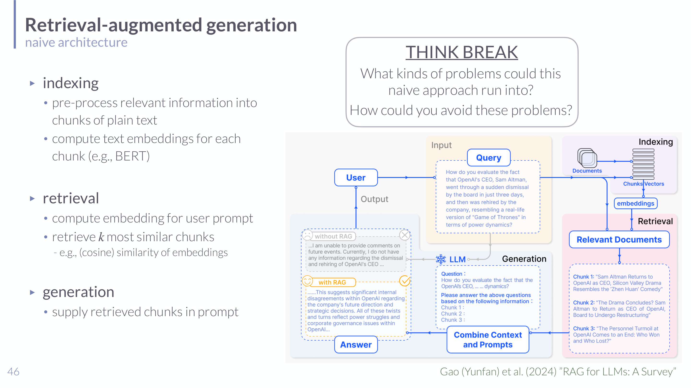

# Retrieval-Augmented Generation in Understanding LLMs

## Short definition

Retrieval-augmented generation is an LM application pattern that retrieves relevant external information and supplies it to a generator so the model can answer with context beyond its fixed internal parameters.

## Intuition

A pretrained model's knowledge is **frozen** at training time and stored fuzzily in its
weights — so it can't cite sources, goes stale, and confidently invents facts
(hallucinates). RAG is the difference between a closed-book exam and an open-book one:
instead of forcing the model to recall everything from memory, you first **look up**
the relevant pages and **paste them into the prompt**, then ask the model to answer
*from that text*. The model's job shifts from "remember the answer" to "read these
passages and synthesize" — which it's much better at, and which lets you update
knowledge by changing the documents, not retraining the model. The key engineering
insight: retrieval works on **meaning, not keywords**, by comparing embedding vectors,
so "What's the capital of the Netherlands?" can find a chunk that says "Amsterdam is
the Dutch capital" even with no shared words.

## Role in this class or project

The class introduces RAG as a central example of an LM-based application rather than a standalone model. It shows how system design around an LLM can reduce hallucination, make evidence more explicit, and update knowledge without retraining.

## Explanation

Naive RAG has three core stages:

1. Indexing: split relevant documents into text chunks and compute embeddings for each chunk.
2. Retrieval: embed the user prompt and retrieve the $k$ most similar chunks, often by cosine similarity.
3. Generation: place the retrieved chunks into the prompt for the generator.

The lecture also notes that practical RAG systems often need more than this naive pipeline. They may optimize chunking, attach metadata, modulate similarity by query intent, rerank retrieved chunks, shorten or summarize chunks, place the most relevant information at useful prompt positions, or use additional loops for output reranking.

## Worked example

A user asks: *"What were our Q3 refund-policy changes?"*

1. **Indexing (offline):** the company handbook is split into ~500-token chunks; each
   chunk $c$ is embedded to a vector $e(c)$ and stored.
2. **Retrieval:** embed the query, $e(q)$, and score every chunk by **cosine
   similarity** $\cos(e(q),e(c))$; take the top $k=3$. The "Refund Policy — 2026 Q3"
   chunk scores 0.82, beating an unrelated "Shipping" chunk at 0.31, even though the
   query never says "shipping."
3. **Generation:** the prompt becomes "Using the following context: «3 chunks», answer:
   What were our Q3 refund-policy changes?" — the model answers *from the pasted text*,
   can quote it, and is far less likely to hallucinate.

If the policy changes next quarter, you re-index the handbook; the model is never
retrained.

## Formal definition / equations

**Retrieval by similarity.** With query embedding $e(q)$ and chunk embeddings
$e(c_1),\dots,e(c_M)$, return the top-$k$ chunks by cosine similarity:
$$ \mathrm{TopK}_k\ \Big\{\, \cos\big(e(q), e(c_j)\big) = \frac{e(q)\cdot e(c_j)}{\lVert e(q)\rVert\,\lVert e(c_j)\rVert} \,\Big\}_{j=1}^{M}. $$
The generator then conditions on the retrieved set $R$:
$P_\theta(y \mid q, R)$ — answer generation grounded in the retrieved context. See
[[Embeddings in Understanding LLMs]] for how the chunk/query vectors are produced.

## Exam, assignment, or project relevance

- Be able to explain the indexing-retrieval-generation pipeline.
- Know which problems RAG is meant to address: hallucination, lack of evidence, and rigid internalized knowledge.
- Understand why chunking, metadata, and reranking matter.
- Distinguish RAG from [[Finetuning and RLHF in Understanding LLMs]]: RAG changes the external context and application pipeline, not necessarily the model weights.

## Related global concepts

No global concept page exists yet for this term.

## Related local pages

- [[Language Models in Understanding LLMs]]
- [[Embeddings in Understanding LLMs]]
- [[Benchmarking LLMs in Understanding LLMs]]
- [[LLM Agents in Understanding LLMs]]

## Common confusions

- RAG is not the same as making the model's parameters know more; it supplies retrieved context at generation time.
- Retrieval quality and prompt placement can matter as much as generator quality.
- A RAG system can be an LM-based application without necessarily being an agent.

## Sources

- [[Session 06 - In-Context Learning, Tool Use, Applications, and Agents]]
