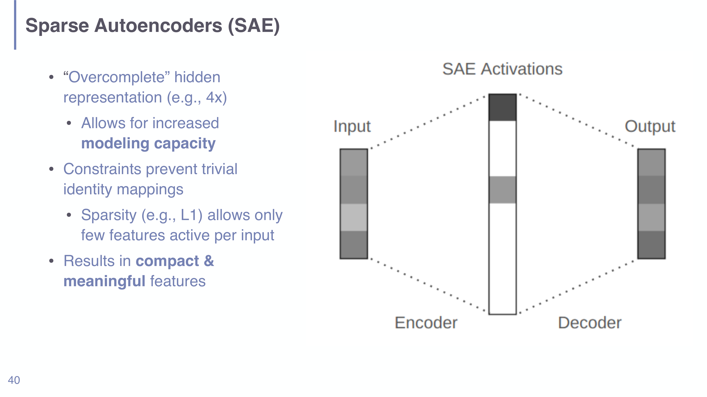
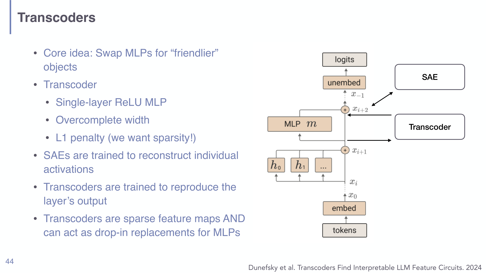

# Sparse Autoencoders and Superposition in Understanding LLMs

## Short definition

**Superposition** is the phenomenon that a model represents *more* concepts than it has neurons by encoding each as a linear combination across many neurons (making neurons **polysemantic**). **Sparse autoencoders (SAEs)** — and their relatives **transcoders** — are dictionary-learning tools that decompose those tangled activations into a large set of sparse, interpretable, (more) **monosemantic** features.

## Intuition

If you had one knob per concept, interpretability would be easy — "this neuron = sentiment." But models don't have that luxury: they need to track far more concepts than they have neurons, so they cram many concepts into shared dimensions, like overloading a small set of light switches to control a huge house by using *combinations* of switches. The cost is that any single switch (neuron) does several unrelated jobs — "Neuron 83" fires on academic citations, English dialogue, HTTP requests, *and* Korean text. A sparse autoencoder is a decoder ring: it expands the cramped activation into a much wider space where, ideally, each dimension lights up for **one** human-meaningful thing, with only a handful active at a time.

## Explanation

**Polysemanticity and superposition** (Elhage et al. 2022, "Toy Models of Superposition"). Activation patching localises *behaviour* to components, but individual neurons resist interpretation because they are **polysemantic** — they respond to multiple unrelated features. The explanation is **superposition**: when a model is pressed to represent more features than it has dimensions, it stores each feature as a direction that is a linear combination across neurons, tolerating a little interference because real features are sparse (rarely active at once). So the "unit of meaning" is a *direction in activation space*, not a single neuron.

**Autoencoder recap.** A standard (**undercomplete**) autoencoder compresses: it maps an input (say 100-dim) down to a smaller hidden code (say 50-dim) and back, trained on a **reconstruction loss**. The narrow bottleneck forces it to learn the most informative directions; difficulty scales with the compression ratio. This is unsupervised representation learning.

**Sparse autoencoders (SAEs)** flip the geometry. Instead of a *narrow* bottleneck, the hidden layer is **overcomplete** — *wider* than the input (e.g. 4×, or even 256×). A wider layer alone would just learn a trivial identity (copy the input), so the SAE adds a **sparsity constraint** (typically an L1 penalty on the hidden activations) forcing only a *few* hidden units ("features") to be active for any given input. The combination — overcomplete width + sparsity — is what makes the learned features **compact and meaningful**: each input is explained as a sparse sum of a few interpretable feature directions. This is dictionary learning: the SAE's decoder columns are a dictionary of feature directions, and the sparse code says which few are present.

*SAE (slide 40): the hidden representation is overcomplete (wider than input/output) but L1-sparse, so each input activates only a few "features." Constraints stop it collapsing to identity; the result is compact, meaningful features.*

**Scale of the problem** (Bricken et al. 2023, "Towards Monosemanticity"). For a toy model with 512 neurons and 256× expansion you get ~131k features. For GPT-3 (12,288 neurons, 256× expansion) that's ~3 million features *per SAE*, and you'd train one per layer (96 layers). The features become interpretable, but interpreting *millions* of them is itself a challenge.

**Why SAEs aren't a silver bullet.** Attention (QK/OV) is relatively well-behaved, but **MLP layers are dense combinations of very many features**, so tracing how a feature *before* an MLP affects features *after* it is generally infeasible. There are input-dependent workarounds (causal intervention) but no general solution.

**Transcoders** (Dunefsky et al. 2024, "Transcoders Find Interpretable LLM Feature Circuits"). The fix is to *replace* the troublesome MLP with a friendlier object. A transcoder is a single-layer, **overcomplete**, **L1-sparse** ReLU MLP — but trained differently from an SAE:

- an **SAE** is trained to **reconstruct an activation** (input ≈ output);
- a **transcoder** is trained to **reproduce the layer's *output*** from its input.

So a transcoder is simultaneously a sparse, interpretable feature map *and* a **drop-in replacement** for the MLP. That dual role lets you discover **input-invariant circuits** (via greedy feature selection) rather than circuits that only hold for one input.

*Transcoder vs. SAE (slide 44, Dunefsky et al. 2024): an SAE reconstructs a single activation; a transcoder reproduces the MLP's output and can stand in for the MLP, enabling circuit discovery through it.*

**Cross-layer transcoders (CLTs)** (Ameisen et al. 2025, "Circuit Tracing"). Per-layer transcoders (PLTs) model one layer; **cross-layer transcoders** read inputs from one layer and **write to all following layers**, capturing downstream effects. You build a *replacement model* by swapping MLPs for CLTs, then construct an **attribution graph** of features across the network — a computational graph of the model's mechanism. Caveats: transcoders are *approximations* of the real model and are computationally expensive, but pretrained ones increasingly ship with open-weight model releases.

## Worked example

Why overcomplete + sparse beats either alone.

1. Suppose an MLP activation is 4-dimensional but the model tracks ~12 distinct concepts in those 4 dims (superposition) — each neuron is polysemantic.
2. **Just go wider (overcomplete, no sparsity):** a 16-dim hidden layer with no constraint learns the identity (it can simply copy the 4 dims into 4 of its 16 units). Nothing is disentangled.
3. **Add L1 sparsity:** now the autoencoder is penalised for activating many units, so it is pushed to explain each input with a *few* of its 16 units. Each unit specialises to a recurring direction — e.g. one fires only for "Korean text," another only for "HTTP requests."
4. Result: the 4 polysemantic neurons are re-expressed as ~12 sparse, **monosemantic** features. You can now name features and trace them — the goal of [[Mechanistic Interpretability in Understanding LLMs]].

## Formal definition / equations

An autoencoder learns encoder $f$ and decoder $g$ minimising reconstruction error; the SAE adds an **overcomplete** hidden width and an **L1 sparsity penalty**:

$$\mathcal{L}_{\text{SAE}} = \underbrace{\lVert x - g(f(x)) \rVert_2^2}_{\text{reconstruction}} + \;\lambda \underbrace{\lVert f(x) \rVert_1}_{\text{sparsity}},\qquad \dim(f(x)) \gg \dim(x).$$

- $x$ — the activation being decomposed; $f(x)$ — the (wide, sparse) feature code; $g(\cdot)$ — the decoder whose columns form the feature dictionary.
- $\lVert\cdot\rVert_2^2$ — reconstruction loss (be faithful to $x$); $\lVert f(x)\rVert_1$ — L1 penalty (use few features); $\lambda$ — sparsity weight trading the two off.
- $\dim(f(x)) \gg \dim(x)$ — **overcompleteness**; without the L1 term this would collapse to a trivial identity.

A **transcoder** keeps the same overcomplete-sparse form but changes the reconstruction *target* from the activation $x$ to the **MLP's output** $m(x)$:

$$\mathcal{L}_{\text{transcoder}} = \lVert m(x) - g(f(x)) \rVert_2^2 + \lambda \lVert f(x) \rVert_1,$$

so $g\circ f$ can replace $m$ while exposing sparse features.

## Role in this class or project

The final ascent of [[Session 08 - Mechanistic Interpretability]]: having localised behaviour with [[Activation Patching in Understanding LLMs]] and read mechanisms with the logit lens, SAEs/transcoders attack the hardest part — the dense, polysemantic interior (especially MLPs) — by re-expressing it in an interpretable feature basis. This is the current frontier the course points students toward.

## Exam, assignment, or project relevance

- Define **superposition** and **polysemanticity** and explain *why* models use them (more features than neurons; features are sparse).
- Contrast **undercomplete (compression)** vs. **overcomplete + sparse (SAE)** autoencoders, and explain why **both** overcompleteness *and* sparsity are needed (else identity collapse).
- State the SAE objective (reconstruction + L1) and the scale issue (millions of features).
- Distinguish **SAE vs. transcoder** by *training target* (activation vs. layer output) and why transcoders enable **input-invariant circuit discovery**; know **CLTs** extend this across layers.
- Cite the honest limitations (MLP density; transcoders are approximations).

## Related global concepts

None yet. A general **Sparse Autoencoder / dictionary learning** page is a promotion candidate; it relates to autoencoder-style representation learning if such a global page is later created.

## Related local pages

- [[Session 08 - Mechanistic Interpretability]]
- [[Mechanistic Interpretability in Understanding LLMs]]
- [[Activation Patching in Understanding LLMs]]
- [[Probing Classifiers in Understanding LLMs]]

## Common confusions

- **Polysemantic neuron ≠ the feature.** The interpretable unit is a *direction* (a sparse feature), not a single neuron.
- **Overcomplete alone does nothing.** Without sparsity, a wider autoencoder just learns the identity; the L1 penalty is what forces disentanglement.
- **SAE ≠ transcoder.** SAEs reconstruct an activation; transcoders reproduce a layer's output and can replace the MLP.
- **Monosemantic ≠ perfectly clean.** Features are *more* interpretable, not provably one-concept; and there are millions of them to interpret.
- **These tools are approximations.** SAEs/transcoders model the network; they are not the network, and MLP density remains hard.

## Sources

- [[Session 08 - Mechanistic Interpretability]] (slides 37–48), `raw/08-Mechanistic-Interpretability.pdf`.
- Elhage et al. 2022 (Toy Models of Superposition); Bricken et al. 2023 (Towards Monosemanticity); Dunefsky et al. 2024 (Transcoders); Ameisen et al. 2025 (Circuit Tracing / CLTs). Cited on the slides; not independently ingested.
