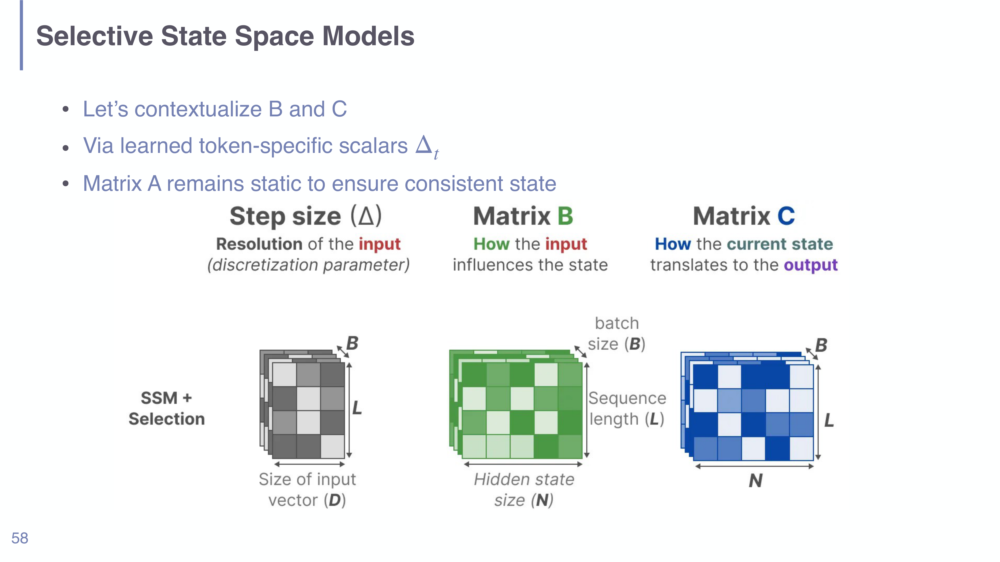

# State Space Models in Understanding LLMs

## Short definition

A **state space model (SSM)** processes a sequence by carrying a hidden **state**
forward one step at a time with a fixed linear update, reading an output from that
state at each step. **Mamba** is an SSM-based language model whose key innovation
is making the update **selective** (input-dependent), giving it the
content-sensitivity of attention at the *linear* cost of a recurrence.

## Intuition

Imagine reading a sentence while keeping a small notebook in your head. At each
word you do two things: **update the notebook** (cross out things no longer
relevant, jot down the new word's contribution) and **read off** whatever you need
for the current output. You never re-read the whole sentence — you only ever look
at your notebook and the current word. That is an SSM: the notebook is the
**state**, and the rules for updating and reading it are fixed matrices.

The problem with a *plain* SSM is that the update rule is the same for every
word — the notebook is kept identically whether the word is "the" or a crucial
named entity. **Mamba's selectivity** is letting the *update rule itself depend on
the current word*: the model learns to write important tokens firmly into the
notebook and let filler tokens pass through. That is the difference between a
mechanical stenographer and an attentive reader.

## Explanation

**Why SSMs exist for LMs.** Self-attention is powerful because every token can
look at every other token, but that is exactly why it is expensive: forming the
$n \times n$ attention matrix costs $O(n^2)$ in sequence length $n$. For very long
contexts (long documents, genomes, audio) this becomes the bottleneck. An SSM
instead summarizes everything seen so far into a fixed-size state and updates it
incrementally, so cost grows **linearly**, $O(n)$. The lecture frames modern LM
layers as doing two jobs — **communication between tokens** and **computation
within a token** — and an SSM is a cheaper replacement for the *communication*
job that attention does.

**The basic recurrence.** An SSM keeps a hidden state $s_t$ and maps input $x_t$
to output $y_t$:
- **Update the state:** copy from the previous state (matrix $A$) and write in the
  new input (matrix $B$).
- **Produce the output:** read from the state (matrix $C$) and optionally copy the
  input directly through (matrix $D$, a skip connection).

In a classic SSM, $A, B, C, D$ are **static** — fixed numbers learned once, used
identically at every position. This makes the whole sequence operation equivalent
to a single long **convolution**, which is why it can be computed in parallel and
why a static SSM is, in a real sense, "just an RNN" (the slide's phrasing) with a
linear update.

**Why static is not enough.** Static matrices "struggle with selective input
scanning." Concretely, tasks like **noun extraction** or the **induction-head**
behavior (copying a token seen earlier in the sequence) require the model to
*decide, based on content*, what to store and what to ignore. A fixed update rule
cannot do that — it compresses every token the same way.

**Selective SSMs (Mamba).** The fix is to make the input-writing matrix $B_t$, the
output-reading matrix $C_t$, and the **time-step** $\Delta_t$ **functions of the
current token** (learned token-specific values), while keeping $A$ static so the
state stays stable and consistent. Now the model can *gate* its memory: a large
$\Delta_t$ lets a token strongly influence the state, a small one lets it pass
through. This recovers the content-awareness that made attention powerful. The
slide's three selling points:

1. **Linear complexity** in sequence length — much faster than attention on long
   sequences.
2. **Content-aware** — because $B_t, C_t, \Delta_t$ depend on the input, the model
   dynamically gates information (unlike a static convolution or linear SSM).
3. **Highly parallel** — although the recurrence looks inherently sequential, it
   is implemented as a **parallel scan** on the GPU, so training is fast.

*Mamba's selectivity: the step size $\Delta$ (input resolution), $B$ (how the input
writes to the state, shaped by sequence length $L$ and state size $N$), and $C$
(how the state is read out) all become input-dependent, while $A$ stays static
(deck p58).*

**Why Mamba is not everywhere yet.** The lecture is honest about adoption:
immature ecosystem and tooling, performance that is competitive but not clearly
*superior* to Transformers, fewer pretrained checkpoints, less inference/serving
optimization, and plain **Transformer inertia** (it is the standard, well
understood, and heavily engineered).

## Worked example

Take a tiny scalar SSM ($A,B,C,D$ are numbers, state $s$ is a scalar) with
$A=0.9$, $B=0.5$, $C=1.0$, $D=0$, starting at $s_0=0$, fed inputs
$x_1=2,\;x_2=0,\;x_3=0$:

- $s_1 = 0.9\cdot 0 + 0.5\cdot 2 = 1.0,\quad y_1 = 1.0\cdot 1.0 = 1.0$
- $s_2 = 0.9\cdot 1.0 + 0.5\cdot 0 = 0.9,\quad y_2 = 0.9$
- $s_3 = 0.9\cdot 0.9 = 0.81,\quad y_3 = 0.81$

The single "spike" at $t=1$ leaves a trace that **decays** at rate $A=0.9$ — the
state remembers the past, fading geometrically. $A$ controls how long memory
lasts; $B$ controls how strongly inputs are written. In a **selective** SSM,
$\Delta_t$ (which effectively reshapes $A$ and $B$ per token) would let the model
*choose* to write $x_1$ strongly and ignore the zeros — exactly the gating a
static SSM cannot do.

## Formal definition / equations

Discrete state-space recurrence:
$$ s_t = A\,s_{t-1} + B\,x_t, \qquad y_t = C\,s_t + D\,x_t. $$
- $x_t \in \mathbb{R}^{d}$: input (token representation) at step $t$.
- $s_t \in \mathbb{R}^{N}$: hidden state — the fixed-size summary of the past.
- $A \in \mathbb{R}^{N\times N}$: **state-transition** matrix — how much of the
  previous state is carried forward (memory / decay).
- $B \in \mathbb{R}^{N\times d}$: **input** matrix — how the new token is written
  into the state.
- $C \in \mathbb{R}^{d\times N}$: **output** matrix — how an output is read from the
  state.
- $D \in \mathbb{R}^{d\times d}$: **skip / feedthrough** — copies the input
  directly to the output (a residual path).
- $y_t \in \mathbb{R}^{d}$: output at step $t$.

In words: *the new state is the old state pushed through $A$ plus the new input
pushed through $B$; the output is the state read through $C$ plus the input passed
straight through $D$.*

**Selective (Mamba) variant.** Make the input-dependent pieces token-specific:
$$ s_t = A\,s_{t-1} + B_t\,x_t, \qquad y_t = C_t\,s_t + D\,x_t, $$
with $B_t = f_B(x_t)$, $C_t = f_C(x_t)$, and a per-token step size
$\Delta_t = f_\Delta(x_t)$ that discretizes/scales the update. $A$ stays static.
The $f$'s are small learned linear maps of the current token. This is what turns
a fixed linear filter into a **content-aware gate**, at the cost of giving up the
pure-convolution view (hence the need for the parallel-scan implementation).

**Complexity.** Self-attention: $O(n^2 d)$. SSM: $O(n d N)$ — linear in sequence
length $n$.

## Role in this class or project

Introduced in [[Session 10 - Efficient and Alternative Architectures]] as the
flagship *alternative architecture* — the answer to "attention isn't all you
need." It sits opposite [[Attention and Self-Attention in Understanding LLMs]] in
the course's efficiency story (quadratic attention vs. linear recurrence) and is a
modern, learnable descendant of the recurrent ideas in
[[Neural Sequence Models in Understanding LLMs]].

## Exam, assignment, or project relevance

- Be able to **write the SSM recurrence** and name the role of $A, B, C, D$.
- Explain **why a static SSM fails at selective tasks** (noun extraction, induction
  heads) and **what Mamba's selectivity changes** ($B,C,\Delta$ input-dependent,
  $A$ static).
- State the **complexity contrast** with attention ($O(n)$ vs. $O(n^2)$) and the
  three Mamba advantages (linear, content-aware, parallel scan).

## Related global concepts

- Recurrent neural networks / linear dynamical systems (promotion candidate:
  **State Space Models / Mamba**).

## Related local pages

- [[Neural Sequence Models in Understanding LLMs]]
- [[Attention and Self-Attention in Understanding LLMs]]
- [[Transformer Architecture in Understanding LLMs]]
- [[Model Compression in Understanding LLMs]]
- [[Mixture-of-Experts in Understanding LLMs]]

## Common confusions

- **"An SSM is just an RNN."** Structurally similar (both carry a state with a
  recurrence), but the SSM update is **linear** in the state, which lets it be
  reformulated as a convolution / parallel scan and trained efficiently — the
  thing classic RNNs could not do. Mamba's *selectivity* then adds the
  content-gating that LSTMs achieved with nonlinear gates, but at linear cost.
- **"Selectivity means attention."** No. Selectivity makes the recurrence
  input-dependent, but there is still **no $n\times n$ token-to-token matrix** — a
  token influences the future only *through the compressed state*, never by being
  looked up directly. That is why it stays $O(n)$.
- **"Linear scaling means it's always better."** The slides stress it is
  *competitive, not clearly superior*; Transformers still dominate in practice for
  ecosystem and engineering reasons.

## Sources

- [[Session 10 - Efficient and Alternative Architectures]] (Gu & Dao 2023, Mamba)
