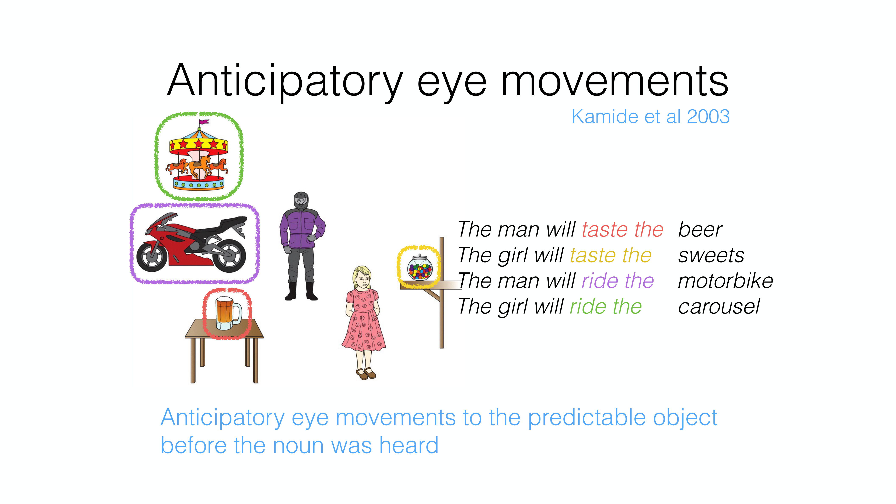
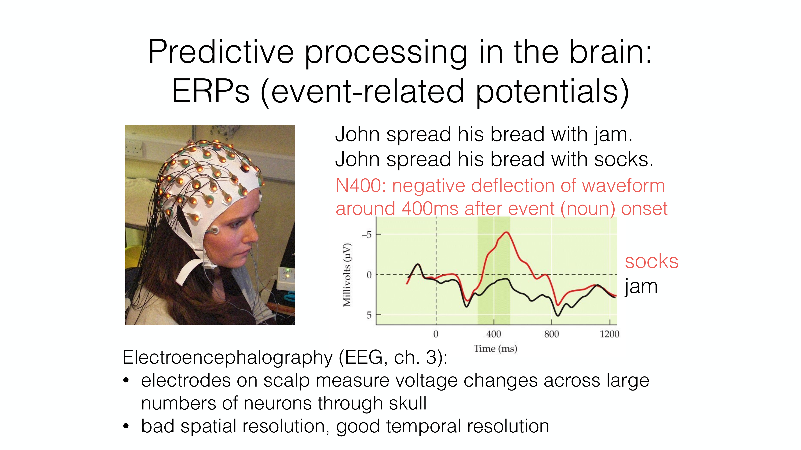
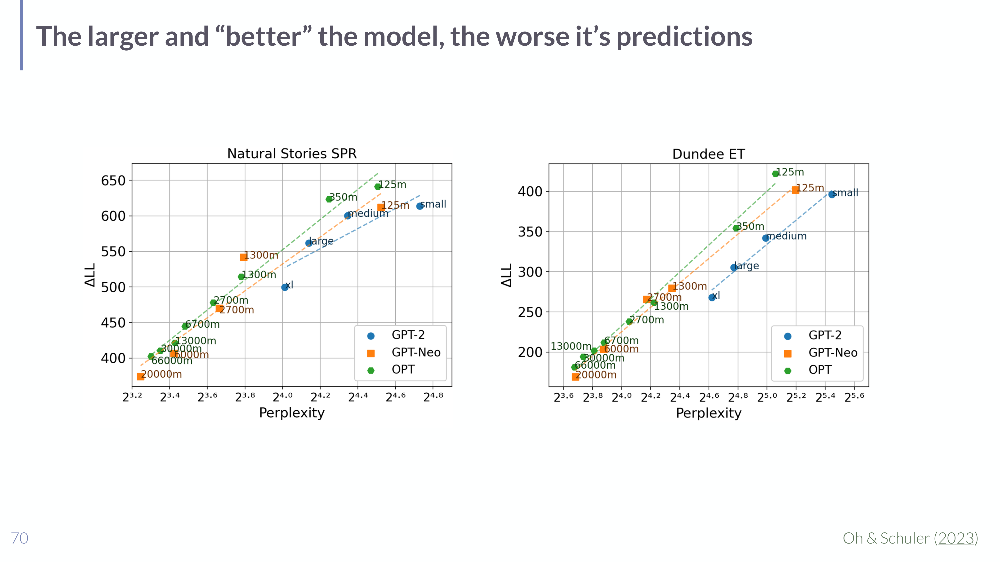

# Surprisal Theory in Understanding LLMs

## Short definition

**Surprisal theory** holds that the cognitive effort of processing a word is proportional to its **surprisal** — its negative log-probability given the preceding context. Because language models compute exactly this probability, they can serve as models of human reading difficulty.

## Intuition

When you read, easy words slide by and unexpected ones make you stumble. Finish the sentence "I take my coffee with milk and ___": "sugar" barely registers, but "socks" jolts you. Surprisal theory makes that precise: the jolt is *how unlikely the word was* given everything you'd read so far. A word you fully expected carries no surprise (low effort); a word you'd assigned tiny probability is a big surprise (high effort), and you read it slower, your eyes linger, and your brain emits a larger electrical response. Since a language model literally outputs $P(\text{next word}\mid \text{context})$, you can take $-\log P$ from the model and check whether it predicts the millisecond-level slowdowns measured in humans.

## Explanation

**The core claim.** Processing effort for word $w_i$ is proportional to its surprisal given prior context $w_{1:i-1}$ and the broader situation $C$:

$$\text{Effort}(w_i, w_{1:i-1}, C) \;\propto\; \text{Surprisal}(w_i\mid w_{1:i-1}, C) = -\log P(w_i\mid w_{1:i-1}, C).$$

The logarithm matters: effort scales with *information content* (in bits/nats), so halving a word's probability adds a constant increment of effort. A perfectly predictable word ($P=1$) has zero surprisal; a near-impossible word has very high surprisal.

**Two compatible mechanisms.** Surprisal theory is agnostic about *why* surprise costs effort, and is compatible with both:

- **Prediction:** comprehenders *actively predict* upcoming words, and processing difficulty is a form of **prediction error** when the actual word differs from expectations.
- **Integration:** comprehenders don't actively predict, but **pre-activation** makes some continuations easier to *integrate* into the unfolding interpretation than others.

**Empirical support** spans many measures: **cloze probability** (humans' guesses for the next word), **eye-tracked reading** (gaze durations), **self-paced reading** (button-press times), **EEG during reading** (the N400), and the **maze task** (forced-choice decision times). Two demonstrations from the lecture:

- **Anticipatory eye movements** (Kamide et al. 2003): hearing "The man will *ride* the …" makes listeners look at the motorbike *before* the noun is spoken, because the verb makes that object predictable — direct evidence of predictive processing.
- **The N400 ERP** (event-related potential): a negative voltage deflection ~400 ms after a word's onset, *larger* for semantically surprising words. "John spread his bread with **socks**" elicits a much bigger N400 than "…with **jam**." Measured with EEG (scalp electrodes; good temporal, poor spatial resolution).

*Anticipatory eye movements (slide 67, Kamide et al. 2003): the verb ("taste"/"ride") makes a particular object predictable, and listeners' eyes move to it before the noun is heard — predictive processing in action.*

*The N400 (slide 68): "…bread with socks" (high surprisal) produces a larger negative deflection ~400 ms post-onset than "…with jam" (low surprisal) — a neural correlate of surprisal.*

**The inverse-scaling twist.** If LMs are good models of human prediction, better LMs should predict reading times better. But **the opposite can happen**: Oh & Schuler (2023) found that *larger, lower-perplexity* models fit human reading times **worse**. Intuitively, a superhuman model finds rare words *less* surprising than humans do, so it underpredicts the human slowdown on exactly those words — its probabilities have diverged from human expectations. This is a caution against equating "better language model" with "better cognitive model."

*Inverse scaling (slide 70, Oh & Schuler 2023): across GPT-2, GPT-Neo and OPT, lower perplexity (better LM) goes with worse fit to human reading data ($\Delta$LL) on both self-paced reading (Natural Stories SPR) and eye-tracking (Dundee ET) — the bigger model is the worse cognitive model.*

**Layer/size matches to processing speed.** Relatedly (Kuribayashi et al. 2025), using the **logit lens** (early decoding, cf. [[Mechanistic Interpretability in Understanding LLMs]]), *small models / early-layer readouts* best explain **"fast" measures** (first-pass gaze duration, self-paced reading times), while *big models / late readouts* best explain **"slow" measures** (N400 amplitude, maze decision times) — different model depths align with different stages of human processing.

## Worked example

Comparing two continuations of "I take my coffee with milk and ___" under an LM.

1. The LM outputs $P(\text{"sugar"}\mid \text{context}) = 0.5$ and $P(\text{"socks"}\mid \text{context}) = 0.0001$.
2. Surprisals (natural log): "sugar" → $-\ln 0.5 \approx 0.69$ nats; "socks" → $-\ln 0.0001 \approx 9.2$ nats.
3. **Prediction:** "socks" should take far longer to read and elicit a much larger N400 — roughly an order of magnitude more "surprise." Plotting model surprisal against measured per-word reading times across many sentences, surprisal theory predicts a positive (often near-linear) relationship — and you'd test the *fit* of a given LM's surprisals against the human data, recalling the inverse-scaling caveat that the *biggest* LM need not fit best.

## Formal definition / equations

$$\text{Surprisal}(w_i\mid w_{1:i-1}, C) = -\log P(w_i\mid w_{1:i-1}, C),\qquad \text{Effort} \propto \text{Surprisal}.$$

- $w_i$ — the current word; $w_{1:i-1}$ — preceding context; $C$ — the broader situation/discourse; $P(\cdot)$ — the (model's or human's) conditional probability.
- $-\log P$ is the word's **information content**: rarer-in-context ⇒ higher surprisal ⇒ predicted higher reading time / larger N400. The proportionality constant and link function are what empirical studies estimate.

## Role in this class or project

The *online-processing* half of "LMs meet the cognitive language sciences" in [[Session 09 - Behavioral Assessment and Cognitive Language Sciences]], complementing the *offline* grammaticality focus of [[Targeted Linguistic Assessment in Understanding LLMs]]. It connects an LM's most basic output — next-token probabilities — to human reading behaviour and neural responses, and reuses the **logit lens** from [[Mechanistic Interpretability in Understanding LLMs]].

## Exam, assignment, or project relevance

- State the surprisal equation $-\log P(w\mid \text{context})$ and the effort proportionality; explain why the log (information content) is used.
- Distinguish the **prediction** vs **integration** mechanisms.
- List human measures that support it (cloze, eye-tracking, self-paced reading, N400, maze) and explain the **N400** and **anticipatory eye movements**.
- Explain the **inverse-scaling** finding (bigger/lower-perplexity LMs can fit reading times worse) and what it implies about "better LM ≠ better cognitive model."

## Related global concepts

None yet. **Surprisal theory** is a promotion candidate (core psycholinguistics, reusable in cognitive-science classes).

## Related local pages

- [[Session 09 - Behavioral Assessment and Cognitive Language Sciences]]
- [[Targeted Linguistic Assessment in Understanding LLMs]]
- [[Behavioral Assessment and Calibration in Understanding LLMs]]
- [[Mechanistic Interpretability in Understanding LLMs]]
- [[Language Models in Understanding LLMs]]

## Common confusions

- **Surprisal is contextual, not a word's global frequency.** "Socks" is a common word but highly surprising *after* "bread with."
- **Lower perplexity ≠ better cognitive model.** Inverse scaling shows the best LM can be the *worst* fit to human reading times.
- **Surprisal theory doesn't commit to "active prediction."** It is compatible with both prediction-error and integration accounts.
- **N400 ≠ grammaticality response.** The N400 tracks semantic surprise/predictability; syntactic violations are more associated with other components (e.g. P600), which the slides don't detail.

## Sources

- [[Session 09 - Behavioral Assessment and Cognitive Language Sciences]] (slides 66–71), `raw/09-behaveAssess-CogSciLing.pdf`.
- Kamide et al. 2003 (anticipatory eye movements); Oh & Schuler 2023 (inverse scaling); Kuribayashi et al. 2025 (early-decoding vs processing measures). Cited on the slides; not independently ingested.
