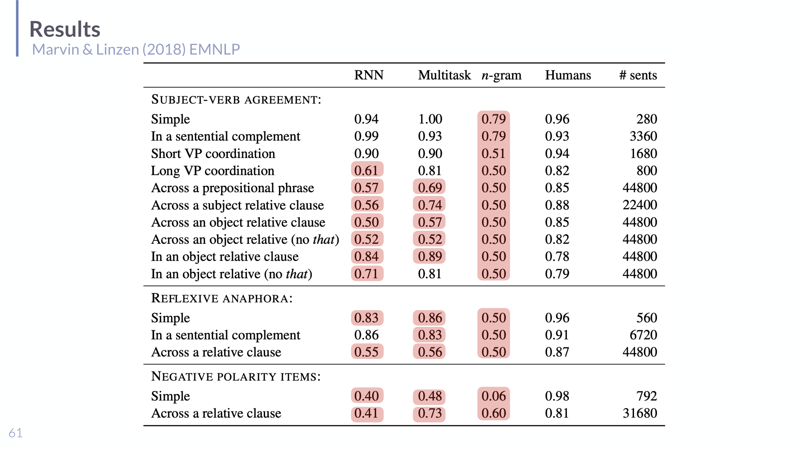

# Targeted Linguistic Assessment in Understanding LLMs

## Short definition

**Targeted linguistic assessment** tests whether a language model has specific *grammatical* knowledge by checking its behaviour on carefully designed **minimal pairs** — sentences that differ only in the grammatical feature of interest — rather than on broad, confounded benchmarks.

## Intuition

A general benchmark score tells you a model is "good at language" the way a final grade tells you a student is "good at school" — it hides *what* they know. To find out whether the model really tracks, say, subject-verb agreement, you don't give it a sprawling exam; you give it surgically matched pairs like *"The author **laughs**"* vs *"The author **laugh**"* where **only** the agreement is at stake, and see if it prefers the grammatical one. Linguists have spent decades designing exactly these contrasts, so the method borrows their test suites. The twist the lecture hammers home: **whether the model "knows" grammar can depend entirely on how you ask** — the same model can look hopeless or expert depending on the probe.

## Explanation

**The research question** (Marvin & Linzen 2018; BLiMP, Warstadt et al. 2020): does model $M$ match human **grammaticality judgements** (offline) and/or human **processing** data (online)? **Method:** take curated **test suites** informed by theoretical linguistics and psycholinguistics, derive predictions from a *pretrained* model **without training it on the task**, and compare to armchair (expert) judgements or actual human data.

**How an LM "judges" grammaticality via probability.** Given a minimal pair — grammatical $w_{1:n}$ vs ungrammatical $v_{1:m}$ — the model is said to predict the right judgement **iff it assigns the grammatical sentence higher probability**:

$$P_M(w_{1:n}) > P_M(v_{1:m}).$$

No fine-tuning, no prompt — just compare the two probabilities. This makes the test purely behavioural and architecture-agnostic.

**The phenomena tested** (Marvin & Linzen): syntactic dependencies that require structure, not just local word statistics —

- **Subject-verb agreement**, in increasing difficulty: simple (*The author laughs/\*laugh*); across a prepositional phrase (*The farmers near the parents smile/\*smiles* — a singular noun intervenes); across **subject** and **object relative clauses** (*The farmer that the parents love swims/\*swim* — the model must keep two subjects apart); VP coordination (short and long).
- **Reflexive anaphora**: *The senators embarrassed themselves/\*herself*, including across sentential complements and relative clauses.
- **Negative polarity items (NPIs)**: *No/\*Most students have **ever** lived here* — "ever" is licensed only by a negative environment.

The difficulty ladder is the point: a model can ace *simple* agreement (local) yet fail agreement *across an object relative clause* (needs hierarchical structure). The classic result compared an n-gram baseline, a plain RNN, and an RNN with extra CCG-supertag supervision against 100 human participants (forced-choice over 76 pairs): **n-gram < simple RNN < multi-trained RNN**, and training-data performance tracked human-judgement prediction.

*Targeted syntactic evaluation (slide 61, Marvin & Linzen 2018): accuracy per phenomenon for RNN / multitask / n-gram vs humans. Models do well on simple/local agreement but degrade on structurally hard cases (object relative clauses, NPIs across a clause); shaded cells mark near-chance performance.*

**Grammaticality ≠ string probability.** A crucial caveat (Chomsky 1957; Wilcox et al. 2023): high probability is *not* the same as grammaticality. A *meaningful but ungrammatical* string can be more probable than a *grammatical but bizarre* one — e.g. GPT-2 assigns the ungrammatical "Snails died the old" a higher probability than the grammatical "The ancient crustaceans expired", because the latter is rare vocabulary. So raw probability conflates grammaticality with plausibility/frequency; good test suites must **separate string likelihood from grammaticality** (e.g. via minimal pairs and syntactic generalization scores).

**Manner of assessment matters** — possibly the single most exam-worthy point. The *same* model gives opposite verdicts depending on the probe:

- **Meta-prompt assessment** ("Is the following sentence grammatical? → yes/no"): LMs often **fail** — $P(\text{"yes"}\mid C) < P(\text{"no"}\mid C)$ even for grammatical sentences.
- **Surprisal/probability comparison** of a minimal pair ($P(S_1) > P(S_2)$): the *same* LMs often **succeed**.

So a headline like "LMs can't do grammar" may be an artefact of asking via meta-prompt; the model's implicit competence shows up under direct probability comparison. This is the common-sense axiom from [[Behavioral Assessment and Calibration in Understanding LLMs]] in action: how you measure determines what you conclude.

## Worked example

Testing subject-verb agreement across an object relative clause with a pretrained LM, no training.

1. Take the minimal pair: $S_g$ = "The farmer that the parents love **swims**." vs $S_u$ = "The farmer that the parents love **swim**." (The distractor subject "parents" is plural; the true subject "farmer" is singular.)
2. Compute sentence probabilities $P_M(S_g)$ and $P_M(S_u)$ (product of token conditionals).
3. **Verdict:** the model predicts correctly iff $P_M(S_g) > P_M(S_u)$. A model that merely tracks the *nearest* noun ("parents … love") may wrongly prefer the plural "swim" — revealing it isn't representing the hierarchical subject. Aggregating over many such pairs gives the per-phenomenon accuracy in the results figure.
4. Contrast: if you instead *asked* "Is 'The farmer that the parents love swim' grammatical?", the model might answer "yes" — failing the meta-prompt version while (often) passing the probability-comparison version.

## Formal definition / equations

Grammaticality prediction on a minimal pair:

$$M \text{ judges correctly} \iff P_M(w_{1:n}) > P_M(v_{1:m})$$

- $w_{1:n}$ — the grammatical sentence (length $n$); $v_{1:m}$ — its ungrammatical counterpart; $P_M(\cdot)$ — the model's sentence probability (product of next-token conditionals). The pair differs minimally, so a correct preference isolates the targeted grammatical feature.

Two assessment manners that can disagree:

$$\underbrace{P(\text{"yes"}\mid C) \lessgtr P(\text{"no"}\mid C)}_{\text{meta-prompt (often fails)}}\qquad\text{vs}\qquad \underbrace{P(S_1) \gtrless P(S_2)}_{\text{surprisal comparison (often succeeds)}}$$

## Role in this class or project

The "LMs meet the cognitive language sciences" pillar of [[Session 09 - Behavioral Assessment and Cognitive Language Sciences]]. It is the *offline* (grammaticality-judgement) counterpart to the *online* processing focus of [[Surprisal Theory in Understanding LLMs]], and a concrete application of the assessment principles in [[Behavioral Assessment and Calibration in Understanding LLMs]].

## Exam, assignment, or project relevance

- State the minimal-pair grammaticality criterion $P_M(w) > P_M(v)$ and why no training is needed.
- Give the three phenomenon families (SV agreement, reflexives, NPIs) and explain why *structural* cases (object relative clauses) are hard.
- Explain **grammaticality ≠ probability** with the Snails/crustaceans example.
- Explain **manner of assessment matters**: meta-prompt fails, surprisal comparison succeeds — and tie it to the common-sense axiom.

## Related global concepts

None yet.

## Related local pages

- [[Session 09 - Behavioral Assessment and Cognitive Language Sciences]]
- [[Surprisal Theory in Understanding LLMs]]
- [[Behavioral Assessment and Calibration in Understanding LLMs]]
- [[Benchmarking LLMs in Understanding LLMs]]

## Common confusions

- **High probability ≠ grammatical.** Probability tracks plausibility/frequency too; use minimal pairs to isolate grammaticality.
- **A failed meta-prompt ≠ no grammatical knowledge.** The same model may pass under probability comparison; the probe, not the model, may be at fault.
- **Good benchmark score ≠ specific syntactic competence.** Targeted suites exist precisely because broad scores are confounded.
- **No fine-tuning involved.** Predictions come from the pretrained model's probabilities directly.

## Sources

- [[Session 09 - Behavioral Assessment and Cognitive Language Sciences]] (slides 48–65), `raw/09-behaveAssess-CogSciLing.pdf`.
- Marvin & Linzen 2018 (EMNLP); Warstadt et al. 2020 (BLiMP); Chomsky 1957; Wilcox et al. 2023. Cited on the slides; not independently ingested.
