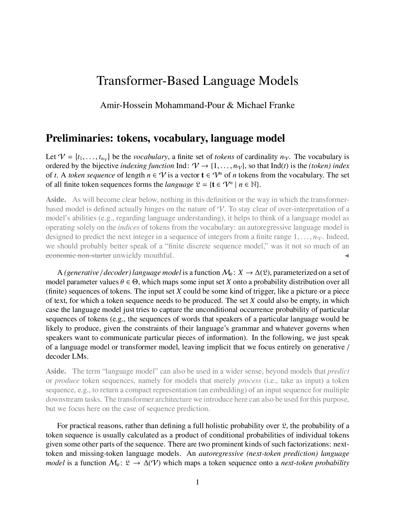
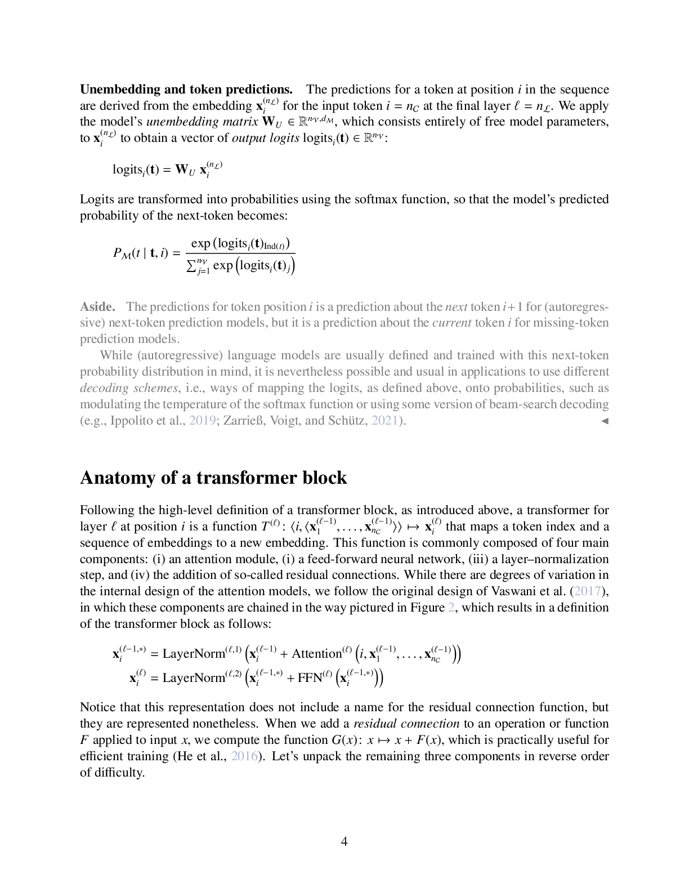

# Transformer Architecture in Understanding LLMs

## Short definition

A **transformer** is a neural sequence architecture built from a stack of identical
**blocks**, each combining **multi-head self-attention** (mix information across
positions) with a **position-wise feed-forward network** (process each position),
wrapped in **residual connections** and **layer normalization**. Token order is
supplied by **positional encodings** because attention is otherwise order-blind.

## Intuition

A transformer is an assembly line that, layer by layer, refines a vector for each
word until it is a rich "contextualized embedding." Each station does two things in
turn: a **mixing step** where every word looks at every other word and pulls in
what's relevant (self-attention), and a **thinking step** where each word digests
what it gathered on its own (the feed-forward network). Two safety rails run the
length of the line: a **residual connection** (a bypass lane so the original signal
is never lost) and **layer normalization** (a regulator keeping the numbers in a
stable range). Stack ~dozens of these stations and the once-static word vectors
become deeply context-aware. Because every word is processed **in parallel** (no
waiting for a previous step as in an RNN), the whole thing trains fast on GPUs.

## Explanation

**Input.** Tokens are embedded into vectors ([[Embeddings in Understanding LLMs]])
and a **positional encoding** is added, because self-attention alone treats the
input as a *bag of words* — it has no notion of order. The original transformer
adds fixed sinusoidal vectors ($\sim\sin(i),\cos(i)$ at varying frequencies) so the
model can recover relative positions.

**One block (encoder).** From the deck, applied to each token vector:
1. **Multi-head self-attention** mixes information across positions →
   contextualized $z_i$ (see [[Attention and Self-Attention in Understanding LLMs]]).
2. **Add & Norm:** a **residual connection** adds the block's input back to its
   output (so gradients and the original signal flow through), then **LayerNorm**
   stabilizes the result.
3. **Position-wise feed-forward network (FFN):** the same small MLP applied
   independently to each position — this is where most parameters live and where
   per-token "computation" happens.
4. **Add & Norm** again around the FFN.

The output $r_i$ vectors are the block's new representations; stacking many blocks
(e.g. 8, 12, 96) deepens the abstraction. This whole stack is a **Transformer
Encoder**.

**Encoder vs. decoder.** The original transformer (built for translation) has both:
- **Encoder** blocks: bidirectional self-attention → contextualized embeddings of
  the input. (BERT is encoder-only.)
- **Decoder** blocks: identical, but with **two** differences — (a) **masked**
  self-attention (a position may attend only to earlier positions, preserving the
  autoregressive property), and (b) an extra **cross-attention** head between
  self-attention and the FFN whose **queries** come from the decoder but whose
  **keys/values** come from the encoder's outputs. GPT-style LLMs are
  **decoder-only**: masked self-attention + FFN, no encoder, no cross-attention.

**Output.** The final-layer vector at each position is **unembedded** into
vocabulary logits ($W_U h$) and softmaxed into a next-token distribution. With
causal masking this makes the model an autoregressive language model (see
[[Autoregressive Language Models in Understanding LLMs]]).

**Why it beat RNNs.** No sequential recurrence ⇒ full parallelism across positions;
direct token-to-token paths ⇒ no vanishing-gradient bottleneck and easy long-range
links. The cost is $O(n^2)$ attention in sequence length and no built-in order
(hence positional encodings).

*The full encoder/decoder transformer: embeddings + positional encodings feeding
stacked attention/FFN blocks (deck p1).*

*One block: multi-head attention → add & norm → feed-forward → add & norm (deck p4).*

## Worked example

Process "The brown dog ran" through one decoder-style block:

1. Embed each word and add its positional vector: $x_i = E w_i + p_i$.
2. **Masked self-attention:** "ran" (position 4) may attend to {The, brown, dog,
   ran} but "The" (position 1) may attend only to itself. Each token gets a
   contextualized $z_i$ (using the scaled-dot-product weights from
   [[Attention and Self-Attention in Understanding LLMs]]).
3. **Add & norm:** $z_i' = \mathrm{LayerNorm}(x_i + z_i)$ — the original $x_i$ is
   added back.
4. **FFN:** $r_i = \mathrm{LayerNorm}(z_i' + \mathrm{FFN}(z_i'))$, with
   $\mathrm{FFN}(u)=W_2\,\mathrm{ReLU}(W_1 u + b_1)+b_2$ applied per position.
5. Stack 12 such blocks; from the final $r_4$, compute
   $\mathrm{softmax}(W_U r_4)$ to predict the token after "ran".

## Formal definition / equations

**Positional input:** $x_i = E w_i + p_i$, with embedding $E w_i$ and positional
encoding $p_i$ (sinusoidal in the original transformer).

**One block** (pre-/post-norm conventions vary; post-norm shown):
$$ z = \mathrm{LayerNorm}\big(x + \mathrm{MultiHead}(x)\big), \qquad r = \mathrm{LayerNorm}\big(z + \mathrm{FFN}(z)\big), $$
$$ \mathrm{FFN}(u) = W_2\,\phi(W_1 u + b_1) + b_2, $$
where $\mathrm{MultiHead}$ is multi-head self-attention, $\phi$ a nonlinearity
(ReLU/GELU), and $W_1\in\mathbb R^{d_{ff}\times d},\,W_2\in\mathbb R^{d\times d_{ff}}$
expand then contract the hidden width.

**LayerNorm** (over the feature dimension of a vector $u$, mean $\mu$, std
$\sigma$, learned $\gamma,\beta$):
$$ \mathrm{LayerNorm}(u) = \gamma\odot\frac{u-\mu}{\sigma+\epsilon} + \beta. $$

**Residual stream view.** Because each sublayer is added back,
$x^{(\ell+1)} = x^{(\ell)} + \text{sublayer}(x^{(\ell)})$ — the representation is a
**running sum** of additive updates, the basis for the residual-stream picture in
[[Mechanistic Interpretability in Understanding LLMs]].

**Output:** $P(w_{t+1}\mid w_{1:t}) = \mathrm{softmax}(W_U\,r_t)$.

## Role in this class or project

The transformer is **the central architecture of the course** — the thing
benchmarked ([[Benchmarking LLMs in Understanding LLMs]]), finetuned
([[Finetuning and RLHF in Understanding LLMs]]), inspected
([[Mechanistic Interpretability in Understanding LLMs]],
[[Probing Classifiers in Understanding LLMs]]), and made more efficient
([[State Space Models in Understanding LLMs]],
[[Mixture-of-Experts in Understanding LLMs]],
[[Model Compression in Understanding LLMs]]). Almost every later page assumes this
block structure.

## Exam, assignment, or project relevance

- **Name the components** of a block (multi-head attention, add & norm, FFN, add &
  norm) and the order.
- **Explain why positional encodings are needed** (attention is permutation-blind).
- **Distinguish** encoder vs. decoder blocks (masked self-attention; decoder
  cross-attention with encoder K/V).
- **Explain** the residual + LayerNorm role (gradient flow, stable training,
  additive residual stream).
- **Trace** embeddings → blocks → unembedding → softmax logits.

## Related global concepts

- Promotion candidate: **Transformer** (architecture reusable across classes).

## Related local pages

- [[Attention and Self-Attention in Understanding LLMs]]
- [[Embeddings in Understanding LLMs]]
- [[Autoregressive Language Models in Understanding LLMs]]
- [[Neural Sequence Models in Understanding LLMs]]
- [[Mechanistic Interpretability in Understanding LLMs]]
- [[Mixture-of-Experts in Understanding LLMs]]
- [[Benchmarking LLMs in Understanding LLMs]]

## Common confusions

- **Architecture vs. model.** A transformer is the *architecture*; an LLM is a
  *trained, large-scale instance* of one.
- **Parallel across positions, sequential across depth.** All positions in a layer
  compute at once, but layers stack one after another.
- **Residual stream ≠ a memory module.** It is just the additive sum of sublayer
  outputs — but that additivity is exactly what makes circuits interpretable.
- **Encoder-only ≠ decoder-only.** BERT (encoder, bidirectional, masked-token
  pretraining) and GPT (decoder, causal, next-token) are different beasts despite
  sharing the block.

## Sources

- [[Session 03 - Transformers]]
- [[Basic Transformer Architecture Slides]]
- [[Session 04 - Transformer-based LMs, Benchmarking, Interpretability, Foundation Models]]
- [[Transformer-Based Language Models]]
