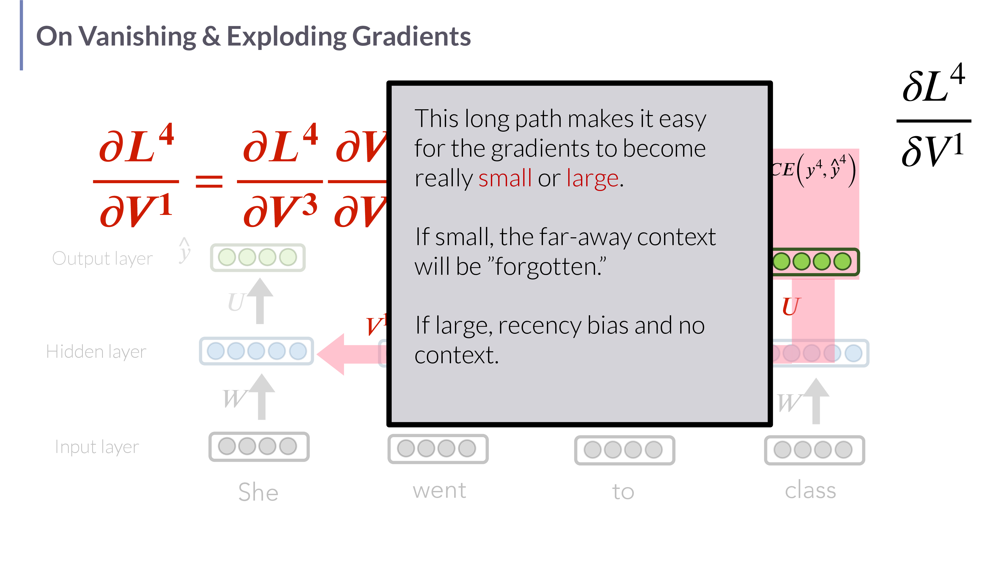
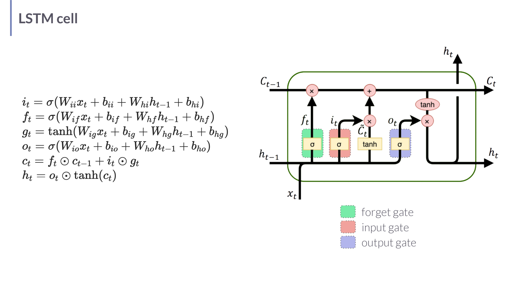

# Session 02 - PyTorch, Optimization, ANNs, LMs, RNNs, LSTMs

## Summary

This is the course's mathematical foundation lecture. It defines a **language
model** precisely — a probability distribution over finite token sequences (the
lecturers argue "finite discrete *sequence* model" is the more honest name) — and
specializes it to the **autoregressive** case, where the model maps a prefix to a
distribution over the *next* token. From that definition it derives the core
measurement vocabulary of the whole course: **surprisal**, **perplexity**, and
**cross-entropy loss**. It then shows how such a model is *trained*: training is
**optimization** — minimizing a loss (negative log likelihood) by **gradient
descent**, computed via **backpropagation**, in the five-step PyTorch training
loop. The second half builds the model classes themselves from the neuron up:
**feed-forward networks** (neurons, activation functions, matrix-vector form),
then **recurrent neural networks** as language models (with explicit forward-pass
equations and embeddings), their training by **teacher forcing** and
**backpropagation through time (BPTT)**, the **vanishing/exploding gradient**
problem that BPTT creates, and finally **LSTMs** — RNNs with a dedicated memory
cell and gates that fix that problem.

The narrative arc is deliberate: *what a language model is mathematically* →
*how you fit one* → *what neural architectures you fit*, ending with the
limitation (poor long-range gradients) that motivates the next lecture's jump to
transformers.

## Key points

- A language model is a **probability distribution over sequences**,
  $\mathrm{LM}\in\Delta(S)$; the autoregressive version is a map from a prefix to
  a **next-token distribution**, $\mathrm{LM}:w_{1:n}\mapsto\Delta(\mathcal V)$.
- **Surprisal** of a token is its negative log probability; **perplexity** and
  **average surprisal** are the standard goodness-of-fit measures, and they are
  the same quantity viewed two ways.
- **Training = optimization.** The objective is **negative log likelihood**
  (equivalently cross-entropy); parameters are moved by **stochastic gradient
  descent** using gradients from **backpropagation**.
- The **five-step training loop**: (1) predict, (2) compute loss, (3)
  backpropagate, (4) update parameters by the learning rate, (5) zero gradients.
- A **neuron** computes a weighted sum plus bias (the *score* $z$) then an
  **activation** $a=f(z)$; common $f$: perceptron step, sigmoid, tanh, ReLU.
- A **feed-forward network** stacks these in matrix-vector form; a softmax output
  layer turns the final scores into a probability distribution.
- An **RNN language model** carries a hidden state $h_t$ that is updated from the
  previous state and the current token embedding, then read out through a softmax.
- RNNs are trained with **teacher forcing** (feed the *true* previous token, not
  the model's own guess) and **cross-entropy** loss, optimized by **BPTT**.
- BPTT multiplies many Jacobians along a long path, so gradients **vanish**
  (far-away context forgotten) or **explode** (recency bias, instability).
- **LSTMs** add a separate memory cell $c_t$ and **forget/input/output gates** to
  carry long-range information with a gradient path that does not shrink as fast.

## Important concepts

- [[Language Models in Understanding LLMs]]
- [[Autoregressive Language Models in Understanding LLMs]]
- [[Optimization for Language Models in Understanding LLMs]]
- [[Neural Sequence Models in Understanding LLMs]]
- [[Embeddings in Understanding LLMs]]

## Methods, models, or theories

### Language model, formally
A vocabulary $\mathcal V$ is a finite set of tokens (characters, sub-words,
words…). $S$ is the set of all finite token sequences. A language model is a
probability distribution $\mathrm{LM}\in\Delta(S)$ — it assigns a probability to
every possible finite string. With an optional set of **input conditions** $X$
(an image to caption, a source sentence to translate), a *parameterized* LM is a
map $\mathrm{LM}_\theta: X\mapsto\Delta(S)$. If $X$ has a single (empty) input,
the LM is just a distribution over all strings.

### Autoregressive (left-to-right / causal) LM
Rather than score a whole sequence directly, factor it with the **chain rule of
probability** into a product of next-token predictions (see
[[Autoregressive Language Models in Understanding LLMs]]). Each factor
$P_{\mathrm{LM}}(w_{i}\mid w_{1:i-1})$ is one forward pass of the model; the
**surprisal** of the realized token is its negative log probability. This is the
setup for both training (predict each true next token) and generation (sample the
next token, append, repeat).

### Optimization as the training principle
Given data $D=\langle X,Y\rangle$, a probabilistic model $M$, and a loss $L$, find
the parameters that minimize total loss. For probabilistic models the canonical
loss is **negative log likelihood**, which for a categorical next-token
distribution *is* the cross-entropy between the one-hot true token and the
predicted distribution. **Backpropagation** computes $\partial L/\partial\theta$
efficiently by the chain rule; **SGD** (and relatives like Adam) take a step
against that gradient. PyTorch automates the gradient via **autodiff**; the human
writes the five-step loop. See [[Optimization for Language Models in Understanding LLMs]].

### Feed-forward neural networks
A **neuron** maps an input vector to a scalar activation. A **layer** stacks many
neurons into a matrix multiply; a network stacks layers, each applying a
nonlinearity. The final layer typically uses **softmax** so the output is a
probability distribution over classes/tokens. Without the nonlinearities the whole
stack would collapse to a single linear map — the activation functions are what
give the network expressive power.

### RNN language model
The RNN reuses **the same** weight matrices at every time step, threading a hidden
state through the sequence. At each step it embeds the token, mixes the new
embedding with the previous hidden state, and reads out a next-token distribution
via softmax. The hidden state plays a **dual role** — memory of the past *and*
basis for the current decision — which the lecture flags as the conceptual weak
point. Variations covered: **stacked** RNNs (deeper = more abstraction) and
**bidirectional** RNNs (concatenate a left-to-right and a right-to-left pass for
richer contextual embeddings, at the cost of not being usable for left-to-right
generation).

### Training RNNs: teacher forcing, CE loss, BPTT
**Teacher forcing**: at training time feed the *ground-truth* previous token, not
the model's own (possibly wrong) prediction, so errors don't compound during
learning. The per-step loss is **cross-entropy** (next-word surprisal); total loss
is the average over the $T$ steps. **Backpropagation through time** unrolls the
recurrence and applies the chain rule backward across every step, summing the
contributions to each *shared* weight matrix. Because this is expensive, updates
are typically done every $T$ steps (e.g. per sentence) rather than after every
token — but the model still has "infinite memory" in principle, unlike a fixed
$n$-gram window.

### Vanishing & exploding gradients → LSTMs
The gradient of a late loss with respect to an early weight is a **product of many
factors** along the unrolled path. If those factors are <1 the product shrinks
toward zero (**vanishing** — long-range context is effectively forgotten); if >1
it blows up (**exploding** — instability, recency bias). The **LSTM** (Hochreiter
& Schmidhuber 1997) adds a dedicated **memory cell** $c_t$ alongside the hidden
state, regulated by **forget**, **input**, and **output** gates. The cell's
near-additive update gives information a path through time that does not get
repeatedly squashed, so long-range dependencies survive. See
[[Neural Sequence Models in Understanding LLMs]].

## Equations or formal definitions

**Autoregressive factorization (chain rule).**
$$ P_{\mathrm{LM}}(w_{1:n}) = \prod_{i=1}^{n} P_{\mathrm{LM}}(w_i \mid w_{1:i-1}). $$
The probability of a whole sequence is the product of each token's probability
given everything before it. $w_{1:i-1}$ is the prefix; the empty prefix gives the
first token's marginal probability.

**Surprisal, perplexity, average surprisal.**
$$ \text{surprisal}(w_{n+1}) = -\log P_{\mathrm{LM}}(w_{n+1}\mid w_{1:n}), $$
$$ \text{Avg-Surprisal}(w_{1:n}) = -\tfrac{1}{n}\log P_{\mathrm{LM}}(w_{1:n}), \qquad \mathrm{PP}(w_{1:n}) = P_{\mathrm{LM}}(w_{1:n})^{-\frac1n}. $$
Surprisal is how "shocked" the model is by the actual token (low probability =
high surprisal). Average surprisal is the mean per-token surprisal; perplexity is
its exponential, $\mathrm{PP}=\exp(\text{Avg-Surprisal})$ in nats — the
"effective number of equally-likely choices" the model faces per token. Lower is
better for both.

**Negative log likelihood / cross-entropy loss.**
$$ L(\theta, x, y) = -\log P_{M(\theta)}(y\mid x), \qquad \hat\theta = \arg\min_{\theta\in\Theta} \sum_{(x,y)} L(\theta,x,y). $$
$\theta$ are the parameters, $(x,y)$ a training pair. For a categorical target the
per-step cross-entropy is $\mathrm{CE}(y_i,\hat y_i) = -\sum_{w\in\mathcal V} y_i^w \log \hat y_i^w$,
where $y_i^w$ is the one-hot true label (1 for the correct token, 0 otherwise) and
$\hat y_i^w$ the predicted probability of token $w$. Because $y_i$ is one-hot this
reduces to $-\log(\text{prob of the correct token})$ — i.e. exactly the surprisal.

**SGD update.** With learning rate $\eta$,
$$ \theta \leftarrow \theta - \eta\,\nabla_\theta L. $$
Move each parameter a small step $\eta$ in the direction that most decreases the
loss. "Stochastic" = the gradient is estimated on a mini-batch, not the whole
dataset.

**Neuron.** Input $x=[x_1,\dots,x_n]^\top$, weights $w$, bias $b$:
$$ z = b + \sum_{j=1}^{n} w_j x_j = b + w\cdot x, \qquad a = f(z). $$
$z$ is the **score** (pre-activation); $a$ the **activation**; $f$ the activation
function. Common choices: perceptron $f(z)=\delta_{z>0}$; sigmoid
$\sigma(z)=\tfrac{1}{1+e^{-z}}$; $\tanh(z)=\tfrac{e^z-e^{-z}}{e^z+e^{-z}}$; ReLU
$\max(z,0)$.

**Feed-forward network (one hidden layer).**
$$ h = f(Wx + b), \qquad y = g(Uh), $$
with weight matrix $W\in\mathbb R^{n_h\times n_x}$, bias $b$, hidden activation $f$
(sigmoid/tanh/ReLU), output weights $U\in\mathbb R^{n_y\times n_h}$, and output
nonlinearity $g$ (often **softmax** so $y$ is a distribution). Deep version:
$a^{[0]}=x$, $a^{[n]}=f^{[n]}(W^{[n]}a^{[n-1]}+b^{[n]})$.

**RNN language-model forward pass.** With one-hot token $w_t$, embedding matrix
$E$, input-to-hidden $W$, hidden-to-hidden $U$, hidden-to-vocab $V$:
$$ x_t = E\,w_t, \qquad h_t = f\!\left(U h_{t-1} + W x_t\right), \qquad y_t = \mathrm{softmax}(V h_t). $$
$x_t$ is the dense embedding of token $t$; $h_t$ the hidden state (with
$h_0=\mathbf 0$); $y_t$ the next-token distribution. The *same* $E,W,U,V$ are
reused at every step — that weight sharing is what makes it a recurrence.

**Vanishing/exploding gradient (BPTT).** The gradient of a late loss $L_T$ w.r.t.
an early hidden state factorizes as
$$ \frac{\partial L_T}{\partial h_1} = \frac{\partial L_T}{\partial h_T}\prod_{t=2}^{T}\frac{\partial h_t}{\partial h_{t-1}}, $$
a product of $T-1$ Jacobians. If their norms are consistently <1 the product
decays geometrically (**vanishing**); if >1 it grows (**exploding**). This is why
long-range learning is hard for vanilla RNNs and why LSTM gates exist.

## Local relevance

This lecture is the prerequisite vocabulary for *everything later*. The
probability/loss framing (surprisal, perplexity, cross-entropy) returns in
[[Benchmarking LLMs in Understanding LLMs]], [[Surprisal Theory in Understanding LLMs]],
and [[Behavioral Assessment and Calibration in Understanding LLMs]]. The
optimization machinery underlies [[Finetuning and RLHF in Understanding LLMs]].
The sequence-model lineage (RNN → LSTM → transformer) sets up
[[Attention and Self-Attention in Understanding LLMs]] and
[[Transformer Architecture in Understanding LLMs]], and the vanishing-gradient
limitation is exactly what [[State Space Models in Understanding LLMs]] revisits
much later.

## Exam or project relevance

- **Define** a language model and an autoregressive language model; **derive** the
  chain-rule factorization.
- **Relate** surprisal, perplexity, average surprisal, and cross-entropy — and be
  able to show CE on a one-hot target equals next-token surprisal.
- **Recite** the five-step training loop and the SGD update rule.
- **Write** the RNN forward pass and explain the hidden state's dual role.
- **Explain** vanishing/exploding gradients from the product-of-Jacobians form,
  and how the LSTM cell/gates address it.

## Selected visuals

*The unrolled BPTT path: $\partial L_4/\partial V_1$ is a chain of derivatives back
through every step. A long product makes gradients easily vanish (far context
forgotten) or explode (recency bias) — deck p71.*

*The LSTM cell with forget, input, and output gates regulating a dedicated memory
cell $c_t$ — the gates and additive cell update are easier to grasp visually than
from prose (deck p76).*

## Links to global concepts

No `Global Wiki/` page was created or modified. **Maximum Likelihood Estimation**,
**Stochastic Gradient Descent / Numerical Optimization**, and **Cross-Entropy /
Shannon Entropy** are standing promotion candidates (they recur across classes).

## Open questions

- The deck shows the LSTM cell diagram but not the gate equations explicitly; the
  full gate formulas are reconstructed in
  [[Neural Sequence Models in Understanding LLMs]] from standard references
  (Jurafsky & Martin). Worth confirming the course's exact notation.
- How much PyTorch *implementation* detail (vs. conceptual understanding) the exam
  expects is still unclear (hw1 is read-only context, not evidence).
