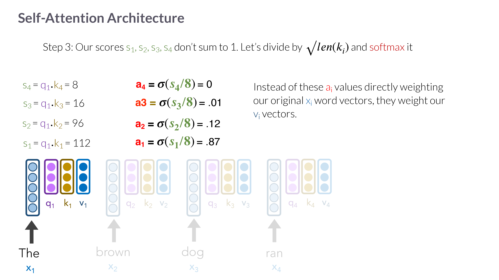

# Session 03 - Transformers

## Summary

This lecture builds the transformer from the ground up, motivated by the failures
of recurrence. It recaps autoregressive language models (adding **entropy** as
expected surprisal) and the RNN/LSTM limitations, then introduces **attention** in
its original encoder-decoder form (a decoder reads a weighted summary of all
encoder states), and generalizes it to **self-attention** (each token attends to
the other tokens of its own sequence to become contextualized). It walks a fully
worked numeric example of **query/key/value** scoring → scaling → softmax →
weighted sum of values, then assembles the full **transformer**: self-attention →
residual + LayerNorm → feed-forward → residual + LayerNorm, plus **positional
encodings**, **multi-head** attention, **stacking**, and the **encoder/decoder**
distinction with **masked** self-attention and **cross-attention**.

## Key points

- An autoregressive LM maps a prefix to a next-token distribution; **surprisal** is
  the negative log prob of the realized token, and **entropy** is the *expected*
  surprisal over all possible next tokens (high entropy = many plausible
  continuations, e.g. "My name is ___").
- RNNs bottleneck information through a single hidden state and suffer
  vanishing/exploding gradients; LSTMs help but don't fully solve it.
- **Encoder-decoder attention**: score the decoder's current state against every
  encoder state, softmax to weights, form a **context vector** = weighted sum of
  encoder states — fixing the seq2seq bottleneck and giving a soft alignment.
- **Self-attention**: each token is projected to **query/key/value**; the new
  representation $z_i$ is a softmax-weighted sum of the **value** vectors.
- Scores are **scaled by $\sqrt{d_k}$** before softmax to avoid saturating it.
- **Positional encodings** are added to inputs because self-attention alone is a
  permutation-blind "bag of words."
- A **transformer block** = multi-head self-attention → add & norm → FFN → add &
  norm. Stacking blocks deepens abstraction; all positions compute in parallel.
- **Decoders** differ from encoders by **masked** self-attention (autoregressive)
  and an extra **cross-attention** head (queries from decoder, keys/values from
  encoder).

## Important concepts

- [[Transformer Architecture in Understanding LLMs]]
- [[Attention and Self-Attention in Understanding LLMs]]
- [[Embeddings in Understanding LLMs]]
- [[Neural Sequence Models in Understanding LLMs]]
- [[Autoregressive Language Models in Understanding LLMs]]

## Methods, models, or theories

### From recurrence to attention
The recap reframes the RNN's problem: one hidden state must both remember the past
and drive the current output, and BPTT makes long-range learning unstable. The
**motivating question**: what if, at each step, the model could *pay attention to a
distribution over all* of the encoder's hidden states — like a human translator
glancing back at different parts of the source while producing each word?

### Encoder-decoder attention (the original)
Given encoder states $h^E_1,\dots,h^E_n$ and the decoder's current state $h^D$, a
small scoring function (e.g. an FFN, but it can be *any* function) produces raw
scores $e_j$, softmax turns them into weights $a_j$, and the **context vector**
$c = \sum_j a_j h^E_j$ is concatenated with $h^D$ to predict the next word. The
worked deck example ("The brown dog ran" → French) shows weights shifting each
decoding step. Side benefit: the weights visualize source-target alignment.

### Self-attention (queries, keys, values)
Motivation: meaning is contextual ("the shirt is green" vs. "the recruits are
green"), but a static type embedding gives "green" one vector. Self-attention
recomputes each token as a weighted blend of its sequence-mates. The deck's pizza
analogy: **query** = what a token is looking for, **key** = what it advertises,
**value** = what it delivers. One head has just three matrices $W_q,W_k,W_v$; the
five steps (project → score → scale+softmax → weight values → repeat) are unpacked
with full numbers in [[Attention and Self-Attention in Understanding LLMs]].

### Assembling the transformer
Pass each self-attention output $z_i$ through a **position-wise FFN**, wrap both
sublayers in **residual connections** (so signal/gradients survive) and
**LayerNorm** (to stabilize). That is a **transformer encoder** block; its outputs
$r_i$ are contextualized embeddings, computable **in parallel** across positions
(unlike LSTMs). Two fixes the deck stresses: add **positional encodings**
($\sim\sin(i),\cos(i)$) because the encoder is otherwise order-blind; and use
**multi-head** attention (run several heads, concatenate) because words relate in
many ways. Stack several encoders for depth.

### Encoder vs. decoder
The original (translation) transformer also has **decoders**, identical to encoders
except: (1) **masked** self-attention — a position may attend only to earlier
positions, preserving the autoregressive property; (2) an extra **cross-attention**
head whose **query** comes from the previous decoder layer but whose **key/value**
come from the encoder outputs. GPT-style LLMs are decoder-only. See
[[Transformer Architecture in Understanding LLMs]].

## Equations or formal definitions

**Entropy (expected surprisal) of the next token:**
$$ H(w_{n+1}\mid w_{1:n}) = -\sum_{v\in\mathcal V} P_{\mathrm{LM}}(v\mid w_{1:n})\,\log P_{\mathrm{LM}}(v\mid w_{1:n}). $$
Surprisal is the cost of *one* realized token; entropy averages it over all
possible next tokens — a measure of the model's uncertainty at this position.

**Self-attention head** (input vectors $x_i$, weight matrices $W_q,W_k,W_v$):
$$ q_i = W_q x_i,\quad k_i = W_k x_i,\quad v_i = W_v x_i, $$
$$ s_{ij} = q_i\cdot k_j,\qquad a_{ij} = \mathrm{softmax}_j\!\left(\frac{s_{ij}}{\sqrt{d_k}}\right),\qquad z_i = \sum_{j} a_{ij}\,v_j. $$
$s_{ij}$ = query-key compatibility; $\sqrt{d_k}$ = key-dimension scaling; $a_{ij}$ =
attention weight (positive, sums to 1 over $j$); $z_i$ = contextualized output.

**Worked numbers** (token $x_1$, "The"): scores $112,96,16,8$ → divide by
$\sqrt{d_k}=8$ → softmax $\approx(0.87,0.12,0.01,0)$ →
$z_1 = 0.87 v_1 + 0.12 v_2 + 0.01 v_3 + 0\, v_4$. (For $x_2$: scores $92,124,22,8$ →
weights $(0.08,0.91,0.01,0)$.)

**Transformer block** (post-norm, per position $i$):
$$ z = \mathrm{LayerNorm}\big(x_i + \mathrm{MultiHead}(x)_i\big),\qquad r_i = \mathrm{LayerNorm}\big(z + \mathrm{FFN}(z)\big). $$
Residual connection $G(x)=x+F(x)$ around each sublayer; positional input
$x_i = E w_i + p_i$.

## Selected visuals

*The pizza analogy for Q/K/V — the course's central intuition for self-attention
(deck p63).*

*Raw dot-product scores become normalized attention weights via softmax, which then
weight the value vectors (deck p70).*

An animated walkthrough of the full QKV → softmax → weighted-sum computation is
embedded in [[Attention and Self-Attention in Understanding LLMs]].

## Local relevance

This is the keystone lecture: it introduces the operation every later session
assumes. It connects back to [[Neural Sequence Models in Understanding LLMs]] (the
RNN/LSTM it replaces) and forward to
[[Transformer Architecture in Understanding LLMs]] (full formalization),
[[Mechanistic Interpretability in Understanding LLMs]] (what gets dissected), and
[[State Space Models in Understanding LLMs]] (the $O(n^2)$ cost it later motivates
fixing).

## Exam or project relevance

- **Define** Q/K/V roles and **work the numeric example** end to end.
- **Write** $\mathrm{softmax}(QK^\top/\sqrt{d_k})V$ and justify the scaling.
- **Distinguish** encoder-decoder attention from self-attention, and encoder from
  decoder blocks (masking, cross-attention).
- **Explain** why positional encodings and multi-head attention are needed.
- **Relate** surprisal vs. entropy at a position.

## Links to global concepts

No `Global Wiki/` page updated. Promotion candidates: **Attention Mechanism**,
**Transformer**.

## Open questions

- How strongly will the exam separate attention as an *interpretability tool* from
  attention as a *computational mechanism*?
