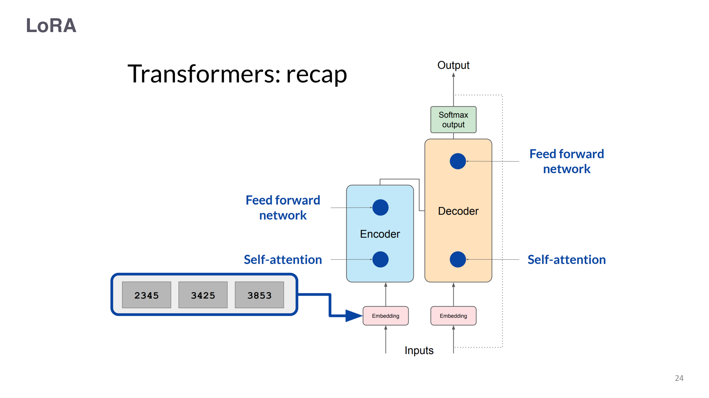
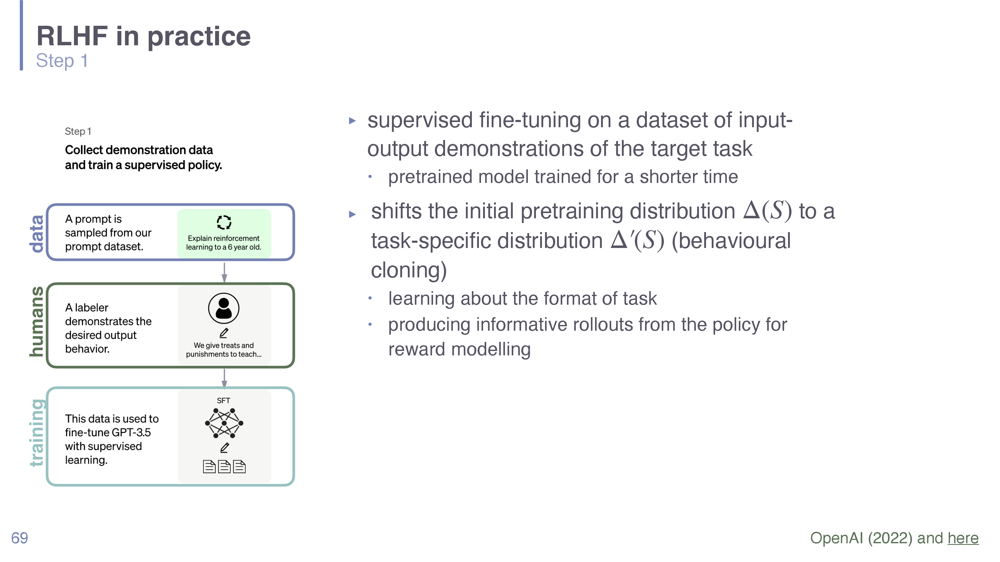
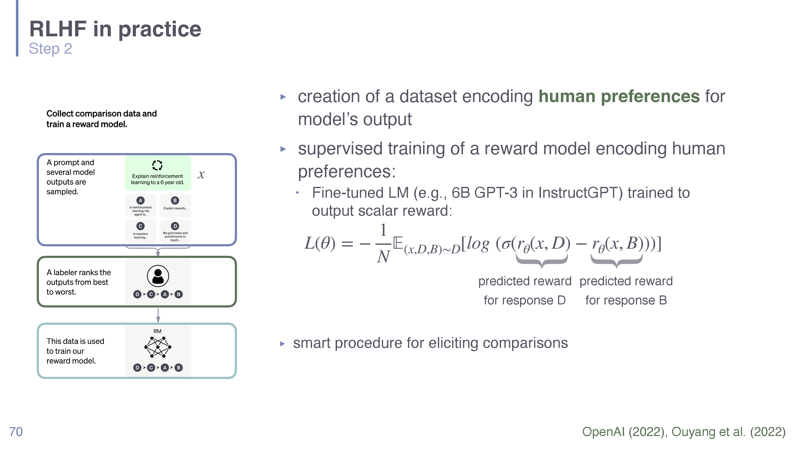
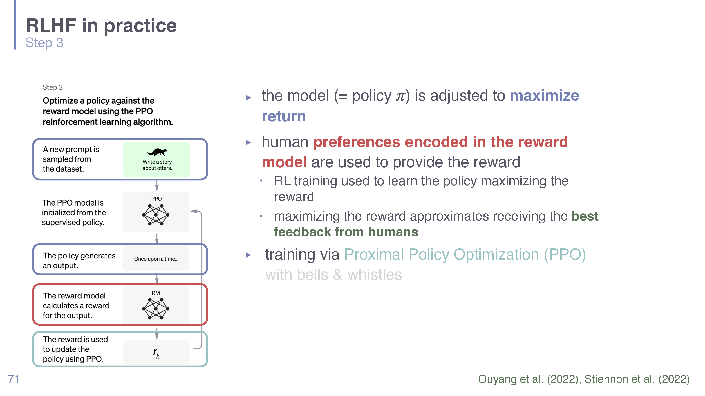

# Session 05 - Finetuning and RLHF

## Summary

This lecture explains how a pretrained base model becomes a useful **assistant**.
The premise: pretraining teaches broad next-token prediction, but "language modeling
≠ assisting users" (Ouyang et al. 2022) — a base model completes text rather than
following intent. The fixes come in layers. **Supervised finetuning (SFT)** imitates
demonstrations; **parameter-efficient** variants (**LoRA, QLoRA, prompt tuning**) make
that affordable; **instruction finetuning** generalizes it across many tasks. Then,
because demonstrations can't cover everything and quality is subjective, **RLHF**
learns from human *preferences*: recap reinforcement learning (MDPs, value functions,
**policy gradients**), learn a **reward model** from comparisons, and optimize the LM
**as a policy** against it — via **PPO** (explicit reward, online RL) or the simpler
closed-form **DPO** (implicit reward, offline supervised loss), always with a **KL
leash** to the reference model to prevent reward hacking.

## Key points

- Pretraining ≠ assisting; finetuning closes the alignment gap.
- **SFT** = cross-entropy on demonstrations; shifts the output distribution
  $\Delta(S)\to\Delta'(S)$ (behavioral cloning) and yields the reference policy
  $\pi_{\mathrm{ref}}$.
- **PEFT**: **LoRA** (low-rank adapters $\Delta W=BA$, freeze the base), **QLoRA**
  (4-bit base + LoRA), **prompt tuning** (learn soft prompt vectors). See
  [[Parameter-Efficient Finetuning in Understanding LLMs]].
- **Instruction finetuning** = SFT over a broad task mix → generalizes to unseen
  instructions.
- **RL recap**: problems are **MDPs** $(S,A,T,R)$; goal is to maximize **expected
  discounted return** $G_t$; **policy-gradient** methods optimize $\pi_\theta$
  directly (gradient *ascent*) — and apply to LMs.
- **The Tay cautionary tale**: learning live from retweets produced a "Nazi bot in 24
  hours" — choose reward signals carefully; learn in a controlled setting instead.
- **RLHF (3 steps)**: SFT → reward model (Bradley–Terry on preference pairs) → policy
  optimization (PPO) with per-token KL penalty.
- **Feedback types**: comparison, ranking, scalar rating, textual (inverse RL),
  correction, label — comparisons dominate (humans are reliable at them).
- **PPO vs. DPO**: explicit vs. implicit reward; online RL vs. offline supervised; 4
  vs. 2 models in memory; reward-hacking/KL-collapse vs. likelihood-displacement.

## Important concepts

- [[Finetuning and RLHF in Understanding LLMs]]
- [[Parameter-Efficient Finetuning in Understanding LLMs]]
- [[Language Models in Understanding LLMs]]
- [[Optimization for Language Models in Understanding LLMs]]
- [[Benchmarking LLMs in Understanding LLMs]]

## Methods, models, or theories

### Supervised & instruction finetuning
SFT trains the model to imitate demonstration pairs with ordinary cross-entropy,
shifting it toward the task distribution and learning task *format*. Instruction
finetuning does this over a broad mixture (recall GLUE/SuperGLUE/HELM) so the model
follows arbitrary instructions. Both are detailed in
[[Finetuning and RLHF in Understanding LLMs]].

### Parameter-efficient finetuning
**LoRA** freezes pretrained $W_0$ and trains a low-rank bypass $BA$; **QLoRA** stores
the frozen base in 4-bit; **prompt tuning** learns continuous prompt vectors. Full
treatment + parameter math in [[Parameter-Efficient Finetuning in Understanding LLMs]].

### Reinforcement learning recap
Problems are **Markov Decision Processes** $(S,A,T,R)$. The agent seeks to maximize
**expected discounted return**. Classical solutions estimate optimal **value
functions** $V^*,Q^*$ (Bellman equations); **policy-gradient** methods instead
optimize the policy $\pi_\theta(a\mid s)$ directly by gradient *ascent* on expected
return — the route used for LMs (the LM *is* the policy: state = context, action =
next token).

### RLHF pipeline
Treat the LM as a policy and use human judgments as the reward signal. Because humans
are slow/expensive, learn a **reward model** $r_\phi$ from preference comparisons
(Bradley–Terry), then optimize the policy against $r_\phi$ with **PPO**, penalizing
divergence from $\pi_{\mathrm{ref}}$ (KL term) so it doesn't reward-hack. **DPO** skips
the reward model via a closed-form solution, turning the whole thing into one
supervised loss. The PPO/DPO/Bradley–Terry equations are unpacked in
[[Finetuning and RLHF in Understanding LLMs]].

## Equations or formal definitions

**Discounted return** (discount $\gamma\in[0,1]$):
$$ G_t = \sum_{k=t+1}^{T}\gamma^{\,k-t-1} R_k = R_{t+1} + \gamma G_{t+1}. $$
Future rewards count, discounted by how far away they are.

**Optimal value functions (Bellman):**
$$ V^*(s) = \max_a \sum_{s',r} P(s',r\mid s,a)\big[r + \gamma V^*(s')\big],\qquad Q^*(s,a) = \sum_{s',r} P(s',r\mid s,a)\big[r + \gamma\max_{a'}Q^*(s',a')\big]. $$

**Policy-gradient objective** (gradient *ascent*, vs. loss-minimizing descent):
$$ \max_\theta\ \mathbb E_{\pi_\theta}[G_t],\qquad \theta_{\text{new}} = \theta_{\text{old}} + \alpha\,\nabla_\theta J, $$
contrast with SFT's $\theta_{\text{new}} = \theta_{\text{old}} - \alpha\,\nabla_\theta L$.

**Reward model (Bradley–Terry):**
$$ P(y_w\succ y_l\mid x) = \sigma\big(r(x,y_w) - r(x,y_l)\big),\quad \mathcal L(\phi) = -\,\mathbb E\big[\log\sigma(r_\phi(x,y_w) - r_\phi(x,y_l))\big]. $$

**KL-constrained RLHF objective and PPO clip:**
$$ \max_{\pi_\theta}\ \mathbb E_{y\sim\pi_\theta}[r(x,y)] - \beta\,D_{\mathrm{KL}}(\pi_\theta\Vert\pi_{\mathrm{ref}}), $$
$$ \mathcal L^{\text{CLIP}} = \mathbb E_t[\min(\rho_t A_t,\ \mathrm{clip}(\rho_t,1-\varepsilon,1+\varepsilon)A_t)] - \beta\,\mathrm{KL}[\pi_\theta\Vert\pi_{\mathrm{ref}}],\quad \rho_t=\tfrac{\pi_\theta(a_t\mid s_t)}{\pi_{\theta_{old}}(a_t\mid s_t)}. $$

**DPO loss** (no reward model):
$$ \mathcal L_{\text{DPO}} = -\,\mathbb E\Big[\log\sigma\Big(\beta\log\tfrac{\pi_\theta(y_w\mid x)}{\pi_{\mathrm{ref}}(y_w\mid x)} - \beta\log\tfrac{\pi_\theta(y_l\mid x)}{\pi_{\mathrm{ref}}(y_l\mid x)}\Big)\Big]. $$

## Selected visuals

*LoRA's low-rank adapter $\Delta W = BA$ added beside the frozen pretrained weight
(deck p24).*

*Step 1 — supervised finetuning / behavioral cloning, producing $\pi_{\mathrm{ref}}$
(deck p69).*

*Step 2 — turning human preference comparisons into a reward model (deck p70).*

*Step 3 — policy optimization (PPO) against the learned reward with a KL penalty
(deck p71).*

## Local relevance

This is the course's account of **alignment** — how
[[Language Models in Understanding LLMs]] become assistants. It reuses
[[Optimization for Language Models in Understanding LLMs]] (SFT = cross-entropy;
PPO/DPO = ascent on new objectives), is made affordable by
[[Parameter-Efficient Finetuning in Understanding LLMs]], and its helpful/honest/harmless
goal feeds [[Behavioral Assessment and Calibration in Understanding LLMs]].

## Exam or project relevance

- **Distinguish** pretraining / SFT / instruction FT / RLHF.
- **State the three RLHF stages** and why a reward model is learned.
- **Write** the Bradley–Terry preference likelihood, the KL-constrained objective,
  and either the PPO clip or the DPO loss.
- **Contrast PPO and DPO** (explicit/implicit reward, online/offline, 4/2 models).
- **Explain LoRA/QLoRA/prompt tuning** at a high level.

## Links to global concepts

No `Global Wiki/` page updated. Promotion candidates: **RLHF**, **PPO**, **DPO**,
**Markov Decision Process**, **LoRA**.

## Open questions

- How deeply will **policy-gradient / PPO math** be tested vs. the conceptual
  pipeline?
- Which alignment failure modes (reward hacking, sycophancy) are covered later?
