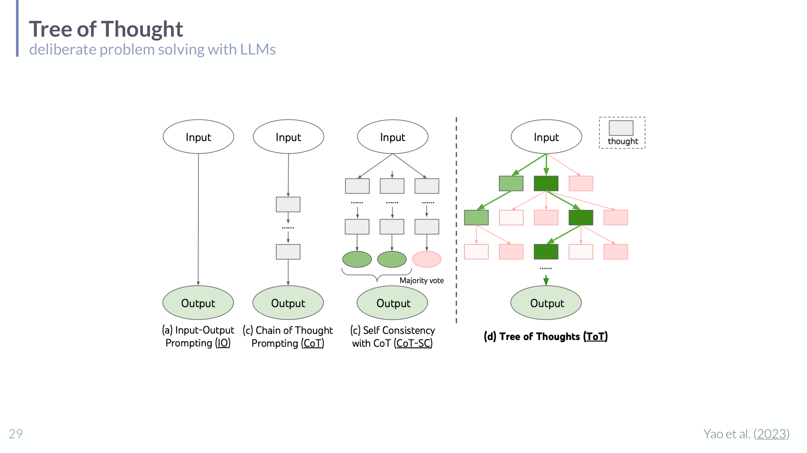

# Session 06 - In-Context Learning, Tool Use, Applications, and Agents

## Summary

This lecture moves from pretrained and RLHF-prepared language models toward prompting, LM-based applications, and agentic systems. It covers in-context learning, prompt engineering strategies such as chain-of-thought and Tree of Thought, retrieval-augmented generation, chat models, tool-using systems, language-model planners, autonomous agents, generative agents, LMs as judges, RLAIF, and language-model-based reward design.

## Key points

- Core LLMs predict statistically likely next tokens, assistants are conditioned to produce outputs that satisfy users, and LM-based applications wrap LMs inside broader algorithms.
- In-context learning uses $k$ demonstrations $(x_i, y_i)$ plus a target input $x_t$ to elicit task behavior without updating model weights.
- The lecture treats ICL cautiously: demonstration format, label-space coverage, and similarity to the target can matter more than correct input-label mappings.
- Prompt engineering extends simple zero-shot and few-shot prompting with chain-of-thought, self-consistency, generated-knowledge prompting, and Tree of Thought search.
- Retrieval-augmented generation addresses hallucination, lack of evidence, and stale internal knowledge by retrieving external context before generation.
- LM agents are LM applications where an LM component influences control flow by generating actions, observing results, and iterating toward a goal or stopping condition.
- Tool-using systems such as Toolformer teach LMs when and how to call APIs, calculators, search engines, or other external tools.
- Generative agents use LMs, memory, planning, and reflection to simulate situated characters in an environment.
- LMs can also be used as evaluators or reward designers, as in Reflexion, constitutional AI, RLAIF, and reward-code generation systems such as Eureka.

## Important concepts

- [[In-Context Learning in Understanding LLMs]]
- [[Prompt Engineering in Understanding LLMs]]
- [[Retrieval-Augmented Generation in Understanding LLMs]]
- [[LLM Agents in Understanding LLMs]]
- [[Language-Model-Based Evaluation and Reward Design in Understanding LLMs]]
- [[Language Models in Understanding LLMs]]
- [[Finetuning and RLHF in Understanding LLMs]]
- [[Benchmarking LLMs in Understanding LLMs]]

## Methods, models, or theories

- Zero-shot prompting
- Few-shot prompting
- In-context learning
- Chain-of-thought prompting
- Self-consistency prompting
- Generated-knowledge prompting
- Tree of Thought
- Retrieval-augmented generation
- Tool use and API calling
- Language-model planning
- Autonomous agents
- Generative agents
- Reflexion agents
- Reinforcement learning from AI feedback
- Language-model reward design

## Equations or formal definitions

In-context learning is presented as prompting with $k$ demonstration pairs and a target input:

$$
(x_1, y_1), \ldots, (x_k, y_k), x_t \mapsto y_t
$$

The naive RAG pipeline retrieves the $k$ most similar chunks to the user prompt, often using embedding similarity such as cosine similarity, then supplies those chunks to the generator.

The lecture proposes a working agent definition: an LM agent is a system in which a language model iteratively generates actions, observes their results, and uses those observations to determine subsequent actions until a goal or stopping condition is met.

## Selected visuals

This slide was selected because it visualizes prompt-based reasoning as search over generated thought states rather than a single linear completion.

This slide was selected because the indexing, retrieval, and generation stages of RAG are clearer as a pipeline diagram.

This slide was selected because it situates modern LM agents in a broader agent taxonomy and helps separate chatbots, tool users, and autonomous agents.

This slide was selected because the interaction between memory stream, retrieval, reflection, planning, and action is easier to understand visually.

This slide was selected because it shows how actor, evaluator, self-reflection, memory, and environment feedback form an agent loop.

## Local relevance

This lecture expands the class from "what an LLM is" and "how assistants are prepared" to "how LLMs are used inside larger systems." It is especially important for distinguishing a model, an assistant, an application, and an agent.

## Exam or project relevance

- Be able to explain why in-context learning may not be learning in the strict parameter-update sense.
- Know which prompt features matter for ICL performance: format, target similarity, label coverage, and explanations.
- Distinguish zero-shot, few-shot, chain-of-thought, self-consistency, generated-knowledge, and Tree of Thought prompting.
- Explain the three core steps of naive RAG: indexing, retrieval, and generation.
- Distinguish chat models, RAG systems, tool users, planners, autonomous agents, generative agents, and LMs as judges.
- Understand why tool use and retrieval can compensate for weaknesses in pure text generation.
- Know how LMs can provide verbal feedback, preference judgments, constitutional feedback, or reward code in downstream learning systems.

## Links to global concepts

No global concept page was updated during this ingestion.

## Open questions

- Which agent taxonomy will the exam expect: the lecture's working definition, the Franklin and Graesser definition, or both?
- How much detail is needed on specific systems such as Toolformer, AutoGPT, Reflexion, constitutional AI, and Eureka?
- Will the course evaluate RAG implementation details or only the conceptual indexing-retrieval-generation pipeline?
