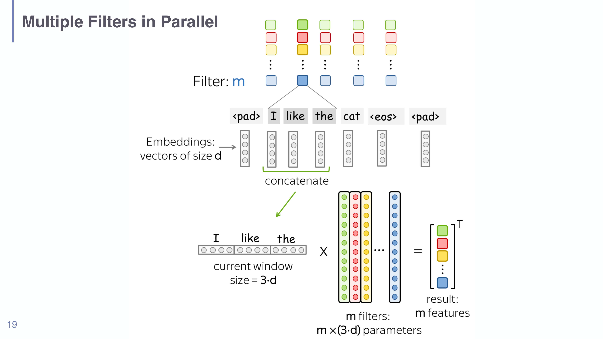

# Session 10 - Efficient and Alternative Architectures

> The deck labels itself "Session 11" internally, but it is the 10th lecture file
> (`raw/10-...`) and follows Session 09 in the course sequence. Named to match the
> file/course numbering.

## Summary

This lecture asks a single practical question: **Transformers work, but they are
enormous and expensive to run — can we get the same quality for less compute,
memory, or energy?** It first reframes the cost problem (training is a one-time
bill; *inference* is paid on every query forever, and at deployment scale
inference cost dwarfs training cost), then walks through five families of
answers. Three of them *shrink an existing Transformer* — **quantization** (store
weights in fewer bits), **pruning** (delete unimportant weights), and
**distillation** (train a small "student" to imitate a large "teacher"). Two of
them *change the architecture* so the expensive part of attention goes away —
**convolutional LMs** (local pattern detectors, constant-time per token) and
**state space models** (Mamba: a learnable recurrence with linear-time scaling).
A final section covers **Mixture-of-Experts (MoE)**, which keeps the Transformer
but makes the feed-forward block *sparse*, so a model can have huge total
capacity while only running a fraction of it per token.

The throughline is a recurring trade-off: every method buys efficiency by giving
something up — precision (quantization), hardware-friendliness (unstructured
pruning), capability on long-range or flexible tasks (CNNs), ecosystem maturity
(Mamba), or memory (MoE pays the full weight bill even though compute is cheap).

## Key points

- **Inference, not training, is the dominant cost** at scale. The slides quote
  that ChatGPT's *weekly* inference cost exceeds its training cost — so methods
  that speed up or shrink inference matter most economically.
- Modern LM layers do two separable jobs: **communication between tokens**
  (attention — the part that scales badly with sequence length) and
  **computation within a token** (the feed-forward block — where most parameters
  live). Almost every efficiency method targets one of these two.
- **Quantization** lowers the *numerical precision* of weights (e.g. 16-bit →
  4-bit). Parameters are not removed, just stored coarsely. Biggest memory win
  for least disruption; the recap frames it as the baseline compression move.
- **Pruning** sets a fraction of weights to exactly zero and leaves the rest
  unchanged. *Magnitude pruning* zeroes the smallest-magnitude weights; *Wanda*
  also weights by activation size; *structured* pruning removes whole components
  (heads, FFN dimensions, layers) so the speedup is real on ordinary hardware.
- **Distillation** changes *almost all* parameters: a small student is trained to
  match a large teacher's **soft** output distribution (which carries more
  information than the hard label). DistilBERT keeps ~60% of the parameters and
  most of the accuracy.
- **Convolutional LMs** slide learned filters over the token sequence to detect
  local patterns regardless of position. Pro: $O(1)$ per-token inference, memory
  efficient, strong locality bias. Con: poor long-range modelling, generally
  weaker than Transformers — used mostly in hybrids (Conformer, RetNet).
- **State space models (Mamba)** replace attention with a *selective* linear
  recurrence: linear $O(n)$ scaling in sequence length instead of attention's
  quadratic $O(n^2)$, while staying content-aware and GPU-parallel.
- **Mixture-of-Experts** swaps the single FFN for $N$ experts and a router that
  fires only the top-$k$ per token — large-model quality at small-model *compute*,
  but you still pay the full *memory* for every expert.

## Methods, models, or theories

### The cost framing (why this lecture exists)
Training a foundation model is a huge but **one-time** cost. **Inference** is
charged per token, per request, indefinitely. Once a model is deployed to many
users, total inference compute overtakes training compute quickly — so a 2×
inference speedup or a 4× memory reduction is worth more in practice than a
cheaper training run. This reframing motivates every technique in the deck.

### Convolutional language models
A 1-D convolution slides a learned **kernel** (filter) of width $w$ across the
sequence of token embeddings, computing a weighted sum at each position. The same
filter is applied everywhere, so it detects a pattern (e.g. a negation, a
bigram) **independent of where it occurs** — the same translation-invariance that
makes CNNs work on images. Key knobs:

- **Kernel size** $w$: how many adjacent tokens each filter sees (the receptive
  field at one layer). Stacking layers grows the effective receptive field.
- **Stride** $s$: how far the filter jumps between applications. Larger stride =
  fewer outputs = more efficient, at the cost of resolution.
- **Padding**: adding boundary tokens so filters can cover the sequence edges and
  so longer sequences are handled cleanly.
- **Multiple filters in parallel**: each filter learns a different pattern; their
  outputs stack into a multi-channel representation.
- **Pooling / k-max pooling**: keep only the strongest $k$ activations of a
  filter across the sequence — a precision/recall knob (more kept = higher
  recall, fewer = higher precision).
- **Residual connections** and **asymmetric (causal) kernel masks** let conv LMs
  go deep and stay autoregressive (a filter may only look leftward, never at
  future tokens).

Verdict from the slides: constant-time inference and a strong locality bias, but
poor long-range capability and generally worse than Transformers — so they
survive mainly inside **hybrid** models (Conformer, RetNet).

*A width-3 convolution slides over "I like the cat": each window concatenates 3
token embeddings (size $3d$) and $m$ filters produce $m$ features — the mechanism
that detects local patterns regardless of position (deck p19).*

### Pruning vs. quantization vs. distillation (the compression trio)
The deck contrasts the three by *what they do to the parameters*:

- **Quantization** — parameters are **not changed**, only stored at up to $k$ bits
  of precision (e.g. FP16 → INT4). A reversible-ish change of representation.
- **Pruning** — a chosen fraction of parameters are **set to zero**; the rest are
  left exactly as they were.
- **Distillation** — **~all** parameters change, because you train a brand-new
  (smaller) network from scratch to mimic the original.

Pruning sub-types: **magnitude pruning** (zero the smallest $|w|$ — unstructured),
**Wanda** (score weights by $|w| \cdot \|\text{activation}\|$, so a small weight on
a large activation is kept), and **structured pruning** (remove whole heads, FFN
dimensions, or layers via learned masks — coarse masks drop entire attention/FFN
blocks, fine masks drop individual heads/dimensions). The catch: *unstructured*
sparsity does **not** automatically speed anything up — you need special hardware
that exploits sparse matrix multiplies, which commodity GPUs largely don't. That
is why **structured** pruning (which yields genuinely smaller dense tensors) is
preferred for real speedups. Newer work (Dery et al. 2024) prunes using only
**forward passes** — masking modules, measuring the performance hit, and
regressing each module's importance — to avoid the memory cost of gradients.

### Distillation in detail
**Weak supervision** underlies distillation: a teacher generates **pseudo-labels**
for unlabeled text, and the student trains on them as if they were ground truth
(old idea: self-training, co-training, meta pseudo-labels).

**Hard vs. soft targets** (Hinton et al. 2015): instead of training on the
one-hot correct answer, the student matches the teacher's full probability
distribution. The "dark knowledge" in the soft distribution — e.g. that "dog" is
slightly probable when the answer is "cat" but "car" is not — teaches similarity
structure a hard label cannot.

**Sequence-level distillation** (Kim & Rush 2016) extends this to generation:
*word-level* distillation matches the teacher's per-step token distribution;
*sequence-level* distillation trains the student to maximize the probability of
whole sequences the teacher would generate.

**DistilBERT** (Sanh et al. 2019): half the layers, ~60% of parameters,
initialized from alternating BERT layers, trained with a combined supervised +
distillation loss plus a cosine-similarity term aligning student and teacher
hidden states.

**Self-Instruct** (Wang et al. 2022) and **Prompt2Model** apply distillation to
*instruction following*: a model synthesizes and pseudo-labels its own
instruction data, then trains on it — a model teaching itself / a smaller model.

### State space models (Mamba)
See [[State Space Models in Understanding LLMs]] for the full treatment. The
lecture's argument: attention scales **quadratically** $O(n^2)$ in sequence
length during training (linearly at inference), and even with Flash/sliding-window
attention, very long contexts hurt. Mamba (Gu & Dao 2023) replaces the attention
("communication") block with a **state space model** — a learnable linear
recurrence with matrices $A, B, C, D$ — that scales **linearly** in sequence
length. The crucial trick is **selectivity**: making $B$, $C$, and the time-step
$\Delta$ *input-dependent* so the model can choose what to remember and what to
ignore, which static SSMs (and plain convolutions) cannot do.

### Mixture-of-Experts
See [[Mixture-of-Experts in Understanding LLMs]] for the full treatment including
the router math and load-balancing loss, which this deck presents in detail
(score experts with $g = W_g h$, keep top-$k$, softmax over the kept logits, run
only those experts and sum their gate-weighted outputs). Rule of thumb from the
slides: $\text{active params} \approx \text{shared} + (k/N)\times\text{expert params}$,
and Mixtral 8×7B is the canonical example (8 experts, top-2, shared attention and
embeddings).

## Equations or formal definitions

**1-D convolution over tokens.** For input embeddings $x_1,\dots,x_n$ and a filter
with weights $W$ of width $w$, the output at position $t$ is
$$ y_t = \sigma\!\left( \sum_{j=0}^{w-1} W_j \, x_{t+j} + b \right), $$
where $W_j$ is the filter weight for offset $j$, $b$ a bias, and $\sigma$ a
nonlinearity. The *same* $W$ is reused at every $t$ — that weight sharing is what
makes the detector position-independent and cheap.

**Magnitude pruning.** Choose a sparsity level $p$. Sort weights by magnitude and
set a mask
$$ m_i = \begin{cases} 0 & |w_i| \text{ in the smallest } p\% \\ 1 & \text{otherwise} \end{cases}, \qquad w_i \leftarrow m_i\, w_i. $$
The premise is that small-magnitude weights contribute little to outputs, so
zeroing them costs little accuracy. **Wanda** refines the score to
$s_i = |w_i| \cdot \|x_i\|$ so a small weight that multiplies a large activation
is *kept*.

**Distillation loss (soft targets).** Let the teacher produce logits $z^T$ and the
student $z^S$. With a **temperature** $\tau$ softening both distributions,
$p^T_i = \mathrm{softmax}(z^T/\tau)$ and $p^S_i = \mathrm{softmax}(z^S/\tau)$, the
distillation term is the cross-entropy / KL between them,
$$ \mathcal{L}_{\text{distill}} = \tau^2 \sum_i p^T_i \,\log \frac{p^T_i}{p^S_i}, $$
usually combined with the ordinary hard-label loss:
$\mathcal{L} = \alpha\,\mathcal{L}_{\text{hard}} + (1-\alpha)\,\mathcal{L}_{\text{distill}}$.
The temperature $\tau>1$ inflates the small probabilities so the student can see
the teacher's similarity structure; the $\tau^2$ factor rescales the gradient
magnitude back. DistilBERT adds a cosine term
$\mathcal{L}_{\cos} = 1 - \cos(h^S, h^T)$ aligning hidden states.

**State space model (continuous → discrete recurrence).** An SSM maps input
$x_t$ to output $y_t$ through a hidden state $s_t$:
$$ s_t = A\,s_{t-1} + B\,x_t, \qquad y_t = C\,s_t + D\,x_t. $$
$A$ carries state forward (memory), $B$ writes the new input into the state, $C$
reads an output out of the state, and $D$ is a skip connection copying the input
straight to the output. In a plain SSM all four are **static** (the same for
every token). **Selective SSMs (Mamba)** make $B_t$, $C_t$ and the step size
$\Delta_t$ **functions of the current token**, keeping $A$ static for a stable
state — see [[State Space Models in Understanding LLMs]].

**Attention vs. SSM complexity.** Self-attention costs $O(n^2 d)$ to form the
$n\times n$ score matrix for sequence length $n$ and width $d$; an SSM processes
the sequence in $O(n d)$ — linear in length — which is the whole point for long
contexts.

## Local relevance

This session is the course's "scaling and efficiency" capstone on the
*architecture* side. It connects backward to nearly everything: it presupposes
the [[Transformer Architecture in Understanding LLMs]] (what is being made
cheaper), [[Attention and Self-Attention in Understanding LLMs]] (the quadratic
bottleneck being attacked), [[Neural Sequence Models in Understanding LLMs]] (SSMs
are a principled cousin of RNNs), [[Finetuning and RLHF in Understanding LLMs]]
and [[Parameter-Efficient Finetuning in Understanding LLMs]] (other efficiency
levers, on the *training* side), and [[Mixture-of-Experts in Understanding LLMs]]
(carried over from Session 09 and developed here). It introduces two genuinely new
concept pages: [[State Space Models in Understanding LLMs]] and
[[Model Compression in Understanding LLMs]].

## Exam or project relevance

High-yield, definition-and-contrast material. Likely targets:

- **Distinguish quantization vs. pruning vs. distillation** by what each does to
  the parameters (precision lowered / set to zero / all retrained). This exact
  three-way contrast appears twice in the deck — a classic exam table.
- **Why unstructured pruning often gives no speedup** (commodity hardware can't
  exploit sparse multiplies) and how structured pruning fixes it.
- **Soft vs. hard targets** and *why* soft targets transfer more (dark knowledge /
  similarity structure); the temperature role.
- **Attention $O(n^2)$ vs. SSM $O(n)$** scaling, and what *selectivity* adds over
  a static SSM or a convolution.
- **MoE active vs. total parameters** and the active ≈ shared + $(k/N)$×expert
  rule of thumb.

## Links to global concepts

No `Global Wiki/` pages were created or modified. Promotion candidates flagged:
**State Space Models / Mamba**, **Knowledge Distillation**, **Model Pruning**, and
**Quantization** are all reusable beyond this class and could become global pages
once they recur.

## Open questions

- The slides are diagram-heavy and text-sparse on the SSM "putting it all
  together" and "selective scan" mechanics; the parallel-scan implementation that
  makes the recurrence GPU-fast is asserted but not derived. Filled in from
  standard Mamba knowledge in the SSM concept page; worth confirming against the
  tutorial (June 25th) if implementation detail is examined.
- The exact quantization scheme used in the recap (and any earlier session on
  scaling/quantization the deck refers back to) is not in this file.
